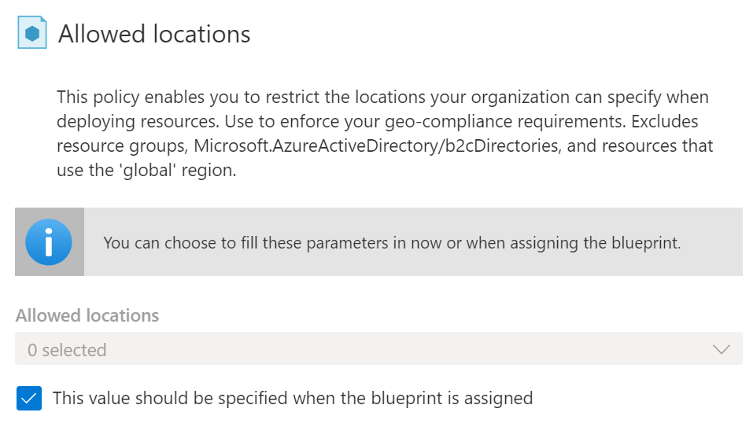

# Azure Blueprints

1. What?
    - Là 1 tính năng giúp lặp lại các setting/config và policy cho subscription/environment
2. Why?
    - Tiết kiệm thời gian công sức khi cần thêm subscription/environment mới
3. How?
    - Các bước để implement:
        - Tạo một Azure Blueprint
        - Assign blueprint đó
        - Track cái assignment đó
    - Track và kiểm tra: mối quan hệ giữa blueprint definition (cái nên được deploy) và blueprint assignment (cái đã được deploy)

### What are Artifacts?
1. What?
- Là đơn vị để gọi cho 1 component trong blueprint

2. How?
- Các artifact có thể nhận các params truyền vào (optional)
- VD: Allowed locations Policy nhận 1 param là vị trí cụ thể

- Params của Artifact có thể được truyền vào khi:
  - tạo mới
  - assign cho 1 scope

    -> 1 blueprint có thể có params khác nhau ở mỗi scope

- Artifact có thể gồm:
    - Role assignments
    - Policy assignments
    - Azure Resource Manager templates
    - Resource groups