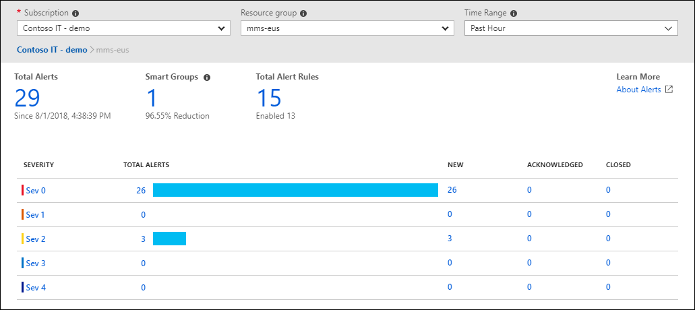

# Azure Monitor

1. What?
- Là nền tảng để thu thập dữ liệu từ các resources của bạn để phân tích, trực quan hoá và hành động dựa trên kết quả

- Chú giải trong hình:
  - Bên trái: nguồn dữ liệu để thu thập
  - Ở giữa: kho lưu trữ dữ liệu đã thu thập
  - Bên phải: cách dữ liệu được sử dụng

2. How?
- Sau đây là 1 vài feature/tool để tiêu thụ lượng dữ kiệu đã thu thập:
  - Azure Log Analytics
  - Azure Monitor Alerts
  - Application Insights

## Azure Log Analytics
1. What?
- Là 1 tool của portal cho phép tự tạo các câu query để tương tác với dữ liệu thu thập bởi Azure Monitor

2. How?
- Có thể viết query để:
  - Sort, filter và analyze dữ liệu
  - Phân tích thống kê và visualize kết quả dạng chart

## Azure Monitor Alerts
1. What?
- Là tính năng tự động thông báo khi Azure Monitor phát hiện thứ gì đó đạt giới hạn (vd: CPU usage)

2. How?
- Có thể setup các ngưỡng/giới hạn hoặc rule để trigger thông báo
- Có thể config những người nhận được noti và thực hiện action gì khi trigger

## Application Insights
1. What?
- Là tính năng của Azure Monitor dùng để quản lý các app của bạn đang chạy trên:
  - Azure
  - On-premise
  - Môi trường cloud khác (vd: AWS)

2. How?
- Có 2 cách config Application Insights:
  - Cài SDK trong app của bạn
  - DùngApplication Insights agent (hỗ trợ C#.NET, VB.NET, Java, JavaScript, Node.js, Python)

- Có thể quản lý những thông tin sau:
  - Tỉ lệ request, thời gian phản hồi và tỉ lệ lỗi
  - Tỉ lệ dependency, thời gian phản hồi và tỉ lệ lỗi
    -> xác định xem service khác có ảnh hưởng performance không 
  - Lượt truy cập trang và tốc độ load trang web
  - Tỉ lệ gọi AJAX từ web page, thời gian phản hồi, tỉ lệ lỗi
  - Đếm số người truy cập và số lần truy cập của họ
  - Đo performance cho các máy chủ Window và Linux (vd: CPU, bộ nhớ, mạng)