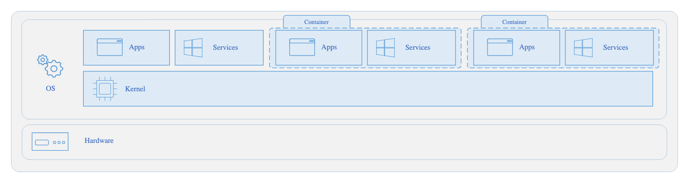
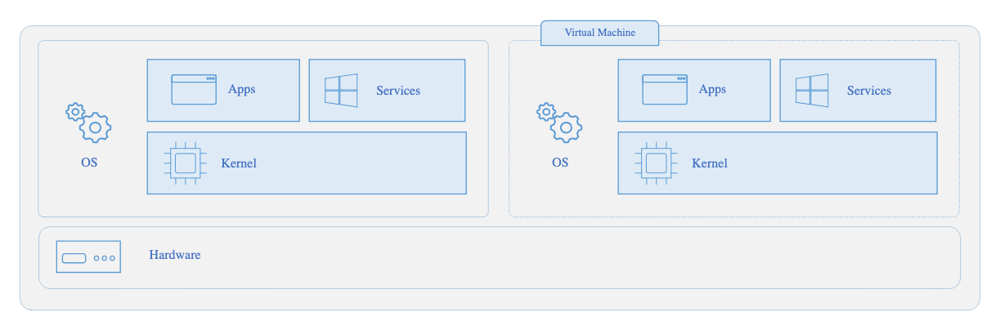

# Container

1. What?
-  Là một môi trường ảo để chạy các app
-  Tương tự VM

## Compare Container vs VM

Container

VM

|                   | Container                    | VM                                |
| ----------------- | ---------------------------- | --------------------------------- |
| **Architecture**  | Không chứa OS và Kernel      | Có OS và Kernel riêng             |
| **Size**          | Nhẹ hơn, phản hồi nhanh hơn  | Tốn tài nguyên hơn (CPU, RAM, ..) |
| **Compatibility** | Dùng chung OS với thằng host | Dùng OS tuỳ ý trong VM            |

## Azure Container Instances
- thuộc dạng **PaaS**
- Cứ upload container lên và service sẽ tự chạy, ko cần cấu hình gì cả

## Use containers in your solutions
- Thường dùng trong kiến trúc Micro-service
- VD: tách FE, BE và DB ra thành từng container riêng
  - dễ bảo trì, scale, update độc lập
  - tránh lỗi ảnh hưởng tới các phần khác
  - không cần build hay deploy lại toàn bộ ứng dụng