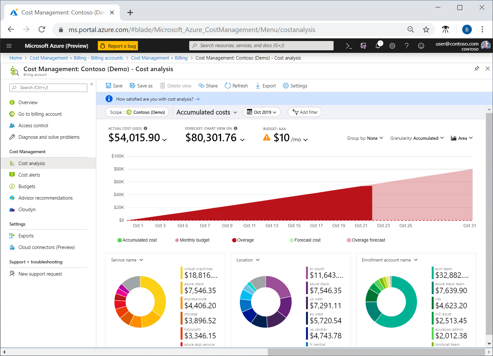

# Azure Cost Management

1. What?
- Là một công cụ giúp quản lý các chi phí của resource

## Budget
1. What?
- Là nơi để bạn đặt hạn mức chi tiêu dựa trên 1 subscription, resource group, service type, ... 
- Khi tạo 1 budget thì sẽ tự động tạo 1 budget alert
- Có thể cấu hình budget alert để tự động gửi email thông báo khi đến ngưỡng
- Có thể cấu hình để tự động tạm ngừng sử dụng resource hoặc điều chỉnh lại resource đó khi đến ngưỡng

## Cost alerts
1. What? 
- Là tính năng thông báo khi lượng tiêu thụ đạt ngưỡng nào đó
- Tự động được gen ra bởi Azure Cost Management
- Có 3 loại:
  - Budget alerts
  - Creadit alerts
  - Department spending quote alerts

### Budget alerts
- Thông báo khi mức chi tiêu đạt hoặc quá ngưỡng budget đã đề ra
- Có 2 cách tạo budget alert:
  - Azure portal: 
  - Azure Consumption API
- Hỗ trợ budget tính theo chi phí hoặc tính theo lượng sử dụng
- Tự động gửi email thông báo tới những người trong budget

### Credit alerts
- Thông báo khi Azure Prepayment (bản thỏa thuận dành cho các doanh nghiệp) được sử dụng
- Tự động tạo khi số dư credit ở ngưỡng 90-100%
- Khi alert được tạo sẽ tự động gửi email thông báo tới chủ account

### Department spending quota alerts
- Thông báo khi 1 phòng ban công ty đạt ngưỡng quota cho phép của 1 phòng
- Cấu hình mức giới hạn cho 1 phòng ban tại EA portal
- Tự động gửi email thông báo tới trưởng phòng ban (vd: khi dùng 50-70% quota)