_Original document: [here](pdf/Data-Mining-Concepts-and-Techniques-3rd-Ed.pdf)_

_Trạng thái phiên dịch: **Closed**_

# Các công nghệ nào được sử dụng?

Là một nghiệp vụ hướng ứng dụng cao, khai phá dữ liệu đã kết hợp nhiều kỹ thuật từ các lĩnh vực khác như thống kê, học máy, nhận diện mẫu, các hệ thống cơ sở dữ liệu và kho dữ liệu, truy xuất thông tin, trực quan hóa, các thuật toán, các máy tính hiệu xuất cao (HPC) và nhiều nghiệp vụ ứng dụng khác với nhau. Tính chất liên ngành của nghiên cứu và phát triển khai phá dữ liệu đóng góp đáng kể vào thành công của khai phá dữ liệu nói chung và các ứng dụng mở rộng của nó nói riêng. Trong phần này, chúng ta sẽ cùng đưa ra các ví dụ về một số ngành có ảnh hưởng mạnh mẽ đến sự phát triển của các phương pháp khai phá dữ liệu.

## Thống kê

Thống kê nghiên cứu về các hoạt động thu thập, phân tích, diễn dịch hoặc giải thích vả trình bày dữ liệu. Khai phá dữ liệu vốn có một mối liên kết với số liệu thống kê.

Một **mô hình thống kê** là một tập hợp các hàm toán học mô tả hành vi của các đối tượng trong lớp mục tiêu dưới dạng các biến ngẫu nhiên và các phân phối xác suất liên quan của chúng. Các mô hình thống kê được sử dụng rộng rãi với mục đích để tạo các mô hình dữ liệu và các lớp dữ liệu. Ví dụ, trong các hoạt động khai phá dữ liệu như mô tả và phân loại dữ liệu, các mô hình thống kê của các lớp mục tiêu có thể được tạo ra

## Học máy

### Học có giám sát

**Học có giám sát** hay còn có thể gọi theo một khái niệm dễ hiệu hơn là sự phân loại. Sự giám sát hay phân loại đó được thể hiện ở chỗ các ví dụ (examples) dùng để đào tạo (training) sẽ được dán nhãn phân biệt.

Ví dụ, trong bài toán nhận dạng mã bưu chính, các hình ảnh mã bưu chính được viết bằng tay và các bản dịch tương ứng mà máy có khả năng đọc được sẽ được sử dụng làm ví dụ đào tạo (training examples) để giám sát việc học của mô hình (model) phân loại

### Học không giám sát

**Học có giám sát** hay còn có thể gọi theo một khái niệm khác là sự phân cụm (clustering). Quá trình học sẽ không có sự giám sát bởi vì các ví dụ đầu vào không được gắn nhãn lớp. Và thường thì chúng ta có thể dùng kỹ thuật phân cụm để khai phá các lớp bên trong dữ liệu.

Ví dụ, một phương pháp **học không giám sát** có thể lấy một tập hợp gồm các ảnh và chữ số viết tay làm đầu vào. Giả sử nó tìm thấy 10 cụm (clusters) dữ liệu, chúng tương ứng với 10 chữ số lần lượt từ 0 tới 9. Nhưng bởi vì các dữ liệu dùng để đào tạo không được gắn nhãn nên các mô hình (model) dù đã được học từ trước nhưng lại không thể cho chúng ta biết được ý nghĩa của các cụm đó.

### Học nửa giám sát

**Học nửa giám sát** là một lớp của các kỹ thuật học máy với khả năng dùng được cả các ví dụ dán nhãn lẫn chưa dán nhãn khi học một mô hình. Cách tiếp cận đó là các ví dụ được dán nhãn sẽ được sử dụng để thiết lập lại các ranh giới giữa các lớp. Đối với bài toán hai-lớp, chúng ta có thể coi tập hợp các ví dụ thuộc về một lớp là các ví dụ tích cực, thuộc về lớp còn lại sẽ là các ví dụ tiêu cực. 

Trong hình 1.12, bỏ qua các ví dụ không dán nhãn thì các đường đứt nét là danh giới quyết định phân tách tốt nhất giữa các ví dụ tích cực và các ví dụ tiêu cực. Chúng ta có thể sử dụng các ví dụ không dán nhãn để thiết lập lại danh giới quyết dịnh thành đường liền nét. Hơn nữa, chúng ta có thể phát hiện ra có 2 ví dụ tích cực ở góc trên bên phải màn hình, dù đã được gán nhãn một ví dụ

### Học chủ động

Học chủ động là một phương pháp học máy cho phép người dùng đóng một vai trò chủ động trong quá trình học. Một phương pháp chủ động học có thể yêu cầu một người dùng dán nhãn cho một ví dụ từ các ví dụ chưa dán nhãn hoặc từ nguồn tổng hợp bởi chương trình học. Mục tiêu là để tối ưu hóa chất lượng mô hình bằng cách tích cực thu thập kiến thức từ người dùng, với hạn chế đi kèm đó là số lượng ví dụ để yêu cầu họ gán nhãn sẽ bị giới hạn.

Bạn có thể nhận thấy có rất nhiều điểm chung giữa khai phá giữ liệu và học máy. Đối với các nhiệm vụ phân loại (classification) và phân cụm (clustering), nghiên cứu về học máy thường tập trung vào độ chính xác của mô hình. Ngoài độ chính xác, nghiên cứu khai phá dữ liệu còn chú trọng vào độ hiệu quả và khả năng mở rộng của các phương pháp khai phá trên các tập dữ liệu lớn, cũng như cách xử lý các loại dữ liệu phức tạp và khám phá các phương pháp mới, có khả năng thay thế.

## Các hệ thống cơ sở dữ liệu và kho chứa dữ liệu

Nghiên cứu hệ thống cơ sở dữ liệu tập trung vào việc khởi tạo, bảo trì và sử dụng cơ sở dữ liệu cho các tổ chức và người dùng cuối. Cụ thể thì các nhà nghiên cứu hệ thống cơ sở dữ liệu đã thiết lập ra các nguyên tắc (được công nhận cao) trong các mô hình dữ liệu, ngôn ngữ truy vấn, các phương thức xử lý truy vấn và tối ưu hóa, các phương thức lập chỉ mục và lưu trữ dữ liệu. Các hệ thống cơ sở dữ liệu thường được biết đến với khả năng mở rộng cao trong việc xử lý các tập dữ liệu rất lớn có cấu trúc tương đối.

Nhiều tác vụ khai phá dữ liệu cần xử lý các tập dữ liệu lớn hoặc thậm trí là dữ liệu truyền nhanh trực tiếp theo thời gian thực. Do đó, khai phá dữ liệu có thể tận dụng tốt các công nghệ cơ sở dữ liệu có khả năng mở rộng để đạt được hiệu quả và tăng khả năng mở rộng trên các tập dữ liệu lớn. Hơn nữa, các tác vụ khai phá dữ liệu có thể sử dụng để mở rộng khả năng của các hệ thống cơ sở dữ liệu hiện có, nhằm đáp ứng các yêu cầu phân tích dữ liệu phức tạp của người dùng nâng cao.

Các hệ thống cơ sở dữ liệu gần đây đã xây dựng được khả năng phân tích dữ liệu trên cơ sở dữ liệu một cách có hệ thống, chúng sử dụng **kho dữ liệu** và **các phương tiện khai phá dữ liệu** để làm điều đó. Một **kho dữ liệu** tích hợp các dữ liệu từ nhiều nguồn gốc và nhiều khung thời gian khác nhau. Nó hợp nhất dữ liệu trong không gian đa chiều để tạo thành các khối dữ liệu được vật chất hóa một phần. Mô hình khối dữ liệu không chỉ tạo điều kiện cho OLAP trong cơ sơ dữ liệu đã chiều mà còn thúc đẩy khai phá dữ liệu đa chiều

## Truy xuất thông tin

# Dissimilarity of Numeric Data: Minkowski Distance

Sự khác biệt của dữ liệu số:

<aside>
💡 Chú ý: bổ sung thêm các ví dụ của Cường nhé

</aside>

Một trong những hoạt động cơ bản của khai phá dữ liệu là tính toán sự khác biệt giữa các đối tượng. Trong phần này, chúng ta sẽ làm quen về các phép đo lường khoảng cách nổi tiếng là: Euclidean, Manhattan và Minkowski.

## Các công thức khoảng cách

### Khoảng cách Euclidean

- định nghĩa: là công thức tính sự khác biệt của các dữ liệu số phổ biến nhất, còn có tên gọi khác là “đường quạ bay”. Nó là đường thẳng nối giữa 2 điểm x và y trên một mặt phẳng
    
    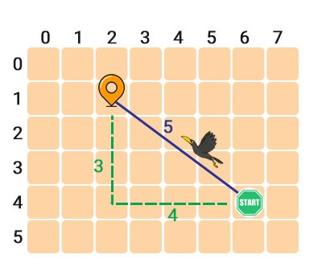

    
- công thức: khoảng cách giữa hai đối tượng **i** và **j** được tính theo công thức sau
    
    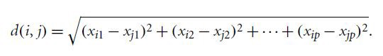

    
- ví dụ: công thức tính quãng đường của con quạ đụt kia áp dụng Pytago

### Khoảng cách Manhattan

- định nghĩa: là một công thức tính sự khác biệt phổ biến thứ hai sau Euclidean, còn có tên gọi khác là bài toán người lái taxi hoặc bài toán khoảng cách khu phố. Trái ngược với Euclidean, Manhattan dùng phương pháp đếm các khu phố mà ta cần đi qua từ điểm khởi hành tới điểm kết thúc.
    
    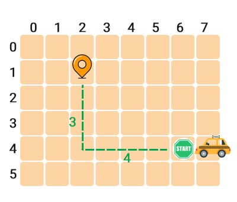

    
- công thức:
    
    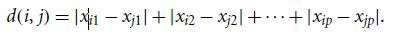

    
    - ví dụ: Dựa theo bản đồ bên dưới, để tới được đích đến, người lái taxi phải di chuyển sang trái 4 khu phố và đi lên trên 3 khu phố

### Khoảng cách Minkowski

- định nghĩa: là công thức tính tổng quát của cả **Euclidean** và **Manhattan**.
- công thức:
    - với **h** là **số thực** (≥1)
    - nếu **h=1** thì kết quả sẽ giống **công thức Euclidean**
    - nếu **h=2** thì kết quả sẽ giống **công thức Manhattan**
    
    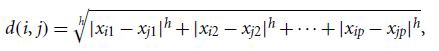

    

### Tính chất chung của khoảng cách **Euclidean và Manhattan**

- **Giá trị không âm**:
    - Khoảng cách giữa hai điểm như **p** và **q** luôn bằng hoặc lớn hơn không: **d (i, j)> = 0**
- **Sự đồng nhất:**
    - Khoảng cách giữa một vật bất kỳ đến vị trí của nó bằng không: **d (i, i) = 0**
- **Tính đối xứng**:
    - Khoảng cách là một thước đo đối xứng: **d (i, j) = d (j, i)**
- **Bất đẳng thức tam giác:**
    - Khoảng cách từ **i** đến **j** không thể lớn hơn khi chúng ta di chuyển từ **i** sang j với đường vòng cung **k** (đi đường cong chứ không đi thẳng)
    - Tổng độ dài hai cạnh bất kì bao giờ cũng lớn hơn độ dài cạnh còn lại.

### Khoảng cách Supremum

- định nghĩa: là công thức tính tổng quát của **Minkowski** với điều kiện **h có giá trị tiệm cận vô cùng.** Supremum rất hữu dụng trong các bài toán tính khoảng cách xa nhất giữa 2 đối tượng.

# Tiền xử lý dữ liệu: Tổng quát

Phần này giới thiệu tổng quát về tiền xử lí dữ liệu.

Phần 3.1.1 minh họa rất nhiều yếu tố định nghĩa nên chất lượng của dữ liệu.

Phần 3.1.2 chỉ ra các nhiệm vụ chính trong công việc tiền xử lý dữ liệu

## Chất lượng dữ liệu: Tại sao cần phải xử lý dữ liệu trước?

1. **Định nghĩa**
    
    **Tiền xử lý dữ liệu** (hay Data preprocessing) là một bước rất quan trọng trong lĩnh vực khai phá dữ liệu. Đây là bước chúng ta sẽ chuyển dữ liệu thô sang một định dạng dễ hiểu, bởi do dữ liệu thực tế thường không đầy đủ, không nhất quán hoặc có khả năng chứa nhiều lỗi.
    
    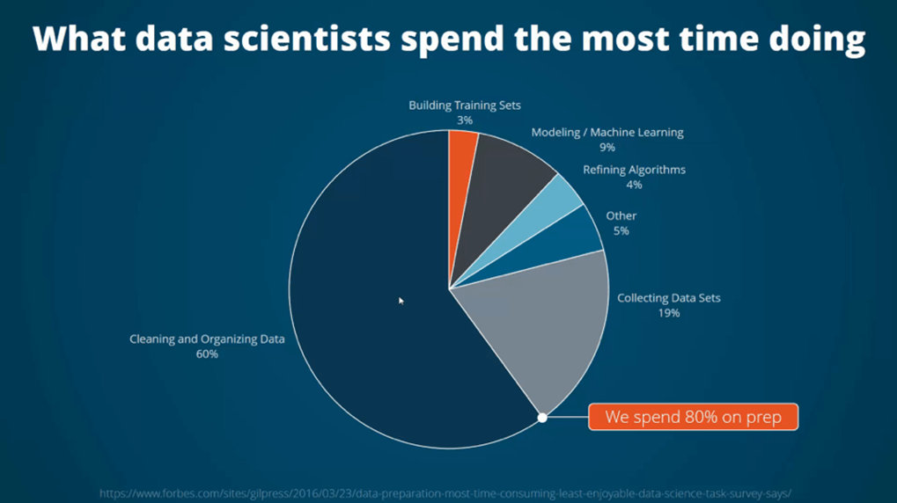

    
2. **Ví dụ** (Phần này nêu trong word và trình bày miệng)
    
    Giả sử bạn là quản lý của công ty đồ điện tử AllElectronics và bạn được giao nhiệm vụ phải phân tích dữ liệu về doanh số bán hàng của công ty. Bạn cẩn thận quan sát, phân tích và chọn lựa từng thuộc tính trong cơ sở dữ liệu và kho dữ liệu (sản phẩm, giá tiền, đơn vị bán) để phân tích. Bất chợt bạn nhận ra rằng, có rất nhiều thuộc tính mà bạn chọn, chúng không có giá trị được ghi lại. Những sản phẩm đã bán có được bán trong đợt giảm giá hay không, không có thông tin gì liên quan được ghi lại để xác định điều đó. Và tất nhiên, đống dữ liệu đó bạn sẽ không thể dùng để phân tích được. Do vậy có thể thấy, việc chuẩn bị dữ liệu (hay còn gọi tiền xử lý dữ liệu) là rất quan trọng.
    
    

    

## Các kĩ thuật trong tiền xử lý dữ liệu

Ở phần này, chúng ta sẽ cùng tìm hiểu về các bước chính liên quan tới tiền xử lí dữ liệu, chúng lần lượt là *làm sạch dữ liệu, tích hợp dữ liệu, giảm thiểu dữ liệu* và *chuyển đổi dữ liệu.*

  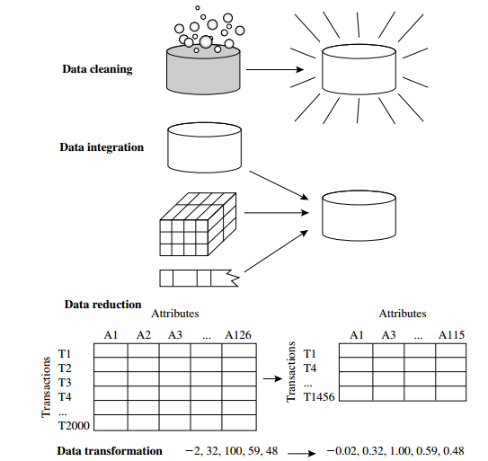

các kĩ thuật tiền xử lý dữ liệu

### Làm Sạch Dữ Liệu - Data Cleaning

1. **What**
    
    

    
    **Data Cleaning** (các tên gọi khác là Data Cleansing, Data Scrubbing) là quá trình chuẩn bị dữ liệu để phân tích bằng cách loại bỏ thông tin không liên quan hoặc không chính xác, không đầy đủ hoặc sai lệch có thể làm sai lệch kết quả và gây ra các quyết định sai lầm hoặc không thực tế.
    
2. **Why**
    
    Việc dữ liệu bẩn sẽ gây ra sự nhầm lẫn trong quy trình khai phá dữ liệu, dẫn tới các kết quả không đáng tin cậy.
    
3. **How**
    
    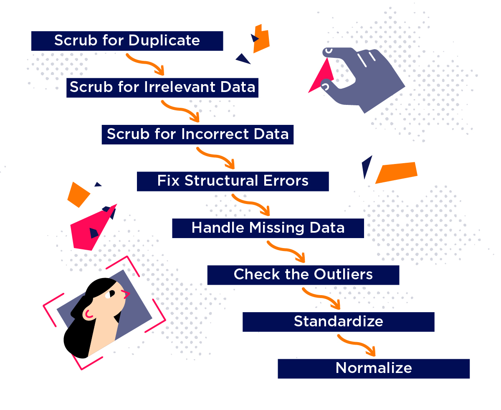

    
    1. Loại bỏ giá trị trùng lặp
    2. Loại bỏ giá trị không liên quan
    3. Loại bỏ giá trị không chính xác
    4. Sửa các lỗi cấu trúc
    5. Làm đầy giá trị trống
    6. Chuẩn hóa
4. **Các tiêu chuẩn của dữ liệu chất lượng**
    
    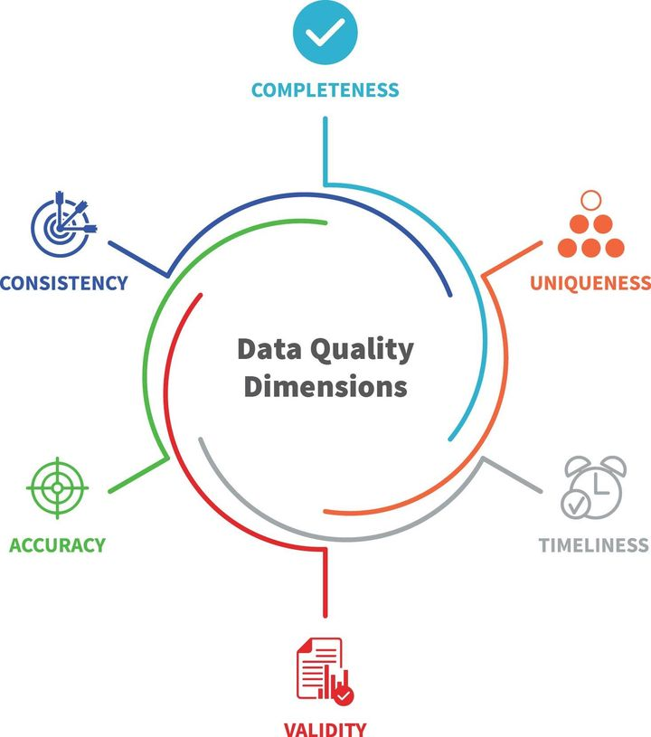

    
    Để xác định được chất lượng của dữ liệu có đạt chuẩn hay không, ta cần phải đánh giá chúng dựa trên các tiêu chí sau:
    
    - Tính đầy đủ - Completeness
    - Tính độc nhất - Uniqueness
    - Tính kịp thời - Timeliness
    - Tính hợp lệ - Validity
    - Tính chính xác - Accuracy
    - Tính nhất quán - Consistency

### Tích Hợp Dữ Liệu - Data Intergration

1. **What**
    
    
    
    **Tích hợp dữ liệu** là quá trình hợp nhất dữ liệu từ nhiều kho dữ liệu khác nhau vào một lược đồ duy nhất và có thể truy vấn, cung cấp cho người dùng cái nhìn nhất quán về chúng.
    
2. **Why**
    
    Việc tích hợp dữ liệu cẩn thận có thể sẽ giúp ta tránh các dữ liệu thừa thãi và tránh mất đi tính toàn vẹn của dữ liệu. Đồng thời, tích hợp dữ liệu còn giúp ta cải thiện độ chính xác và tốc độ cho quá trình khai phá dữ liệu sau này.
    
3. **How**
    
    Chủ yếu có hai loại phương pháp tiếp cận để tích hợp dữ liệu:
    
    1. **Ghép nối chặt chẽ (Tight Coupling)**
        - là quá trình sử dụng **ETL** (Extract, Transform & Load) để kết hợp dữ liệu từ nhiều nguồn khác nhau vào một vị trí vậy lý duy nhất
        
    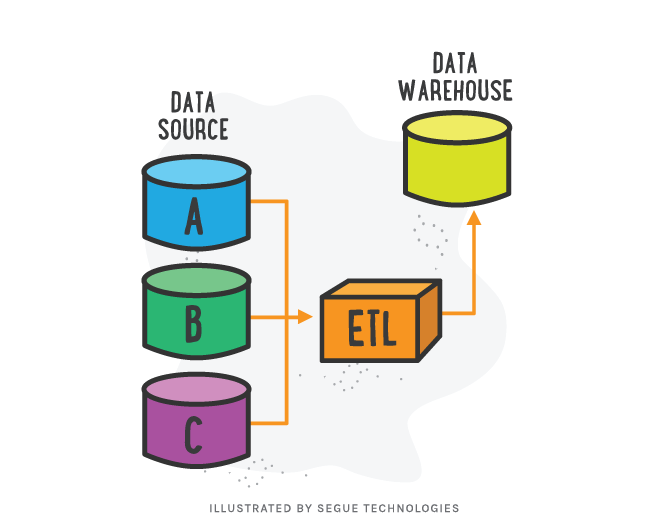
        
    2. **Ghép nối lỏng lẻo (Loose Coupling)**
        - Ở đây một lược đồ trung gian ảo cung cấp một giao diện nhận truy vấn từ người dùng, biến đổi nó theo cách mà cơ sở dữ liệu nguồn có thể hiểu và gửi truy vấn trực tiếp tới cơ sở dữ liệu nguồn để thu được kết quả. Trong phương pháp này, dữ liệu chỉ nằm trong cơ sở dữ liệu nguồn thực tế. Mô hình của phương pháp ghép nối lỏng lẻo được mô phỏng như hình dưới.
        
    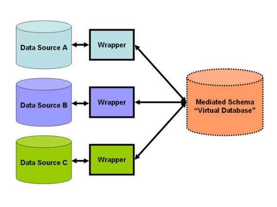

### Giảm Thiểu Dữ Liệu - Data Reduction

1. **What**
    
    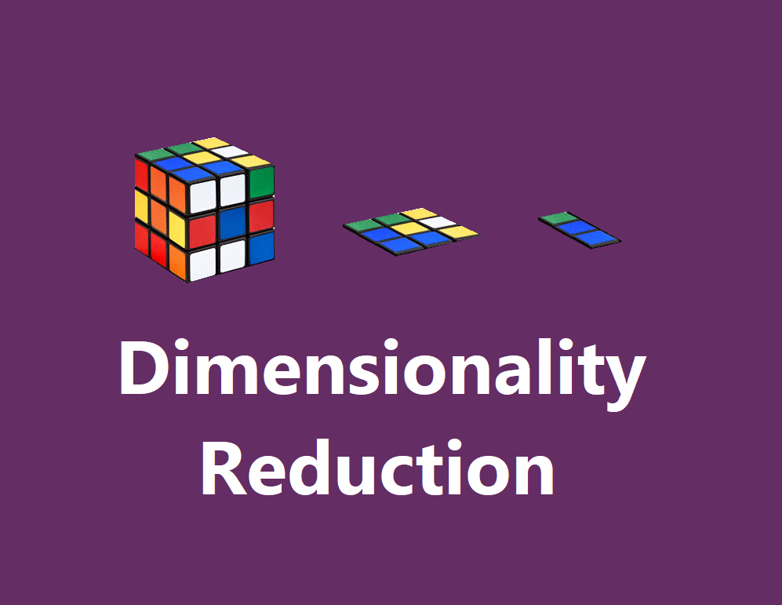
    
    **Giảm thiểu dữ liệu** là kỹ thuật loại bỏ những thuộc tính dư thừa khỏi tập dữ liệu ban đầu mà không làm ảnh hưởng (hoặc nằm trong ngưỡng cho phép) đến kết quả của việc khai phá sau này.
    
2. **Why**
    
    Việc khai phá từ tập dữ liệu sau khi được thu giảm kích thước của dữ liệu và làm cho việc phân tích trở nên khả thi hơn, giúp cải thiện tốc độ và hiệu năng hơn so với tập dữ liệu ban đầu.
    
3. **How**
    
    Có 2 chiến lược để giảm thiểu dữ liệu, chúng là ***dimension reduction*** (giảm chiều dữ liệu) và ***numerosity reduction*** (giảm số lượng dữ liệu)
    
    |  | Dimension | Numerosity |
    | --- | --- | --- |
    | Định Nghĩa | Dữ liệu được mã hóa, được biến đổi để giảm hoặc nén dữ liệu gốc | Dữ liệu gốc được thay thế bằng hình thức biểu diễn dữ liệu nhỏ hơn |
    | Chức Năng | Có thể dùng để loại bỏ các thuộc tính thừa thãi hoặc không liên quan | Chỉ đơn thuần là một kỹ thuật biểu diễn dữ liệu gốc thành dạng nhỏ hơn |
    | Tính Toàn Vẹn | Một số dữ liệu không liên quan có thể bị mất | Không xảy ra mất mát dữ liệu |
    | Phương Thức | - Feature Selection
    - Feature Extraction | - Parametric
    - Non-parametric |
    

### Chuyển Đổi Dữ Liệu và Rời Rạc Hóa Dữ Liệu - Data Transformation & Data Discretization

1. **What**
    - **Chuyển đổi dữ liệu** là quá trình sửa đổi, tính toán, phân tách và kết hợp dữ liệu thô thành các mô hình dữ liệu phù hợp với quá trình khai phá dữ liệu
        
    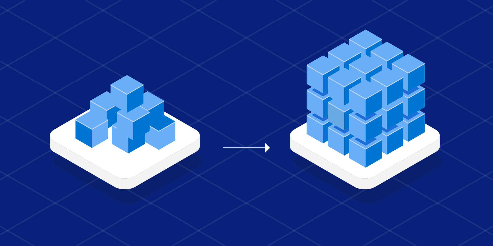
        
    - **Rời rạc hóa dữ liệu** là quá trình biến đổi các mô hình hoặc hàm liên tục thành các khoảng hữu hạn (bins)
        
    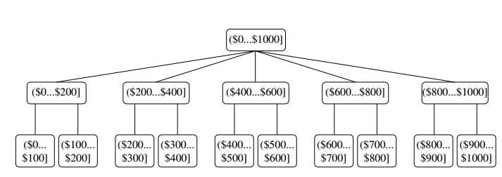
        
2. **Why**
    - **Chuyển đổi dữ liệu** cho việc khai phá dữ liệu trở nên hiệu quả, và các mô hình trở nên dễ hiểu hơn
    - **Rời rạc hóa dữ liệu** để tăng độ tổng quát thông tin, giúp cho việc đơn giản hóa việc biểu diễn cũng như xử lý trên dữ liệu số
3. **How**
    - Chuyển đổi dữ liệu:
        
    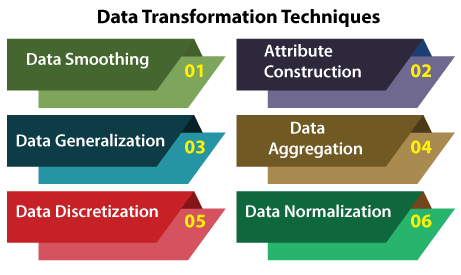
        
        1. **Smoothing**: quá trình loại bỏ các dữ liệu nhiễu bằng thuật toán
        2. **Attribute Construction**: quá trình tạo ra các thuộc tính mới đễ hỗ trợ cho quy trình khai phá dữ liệu
        3. **Generalization**: quá trình chuyển đổi các thuộc tính dữ liệu cấp thấp thành các thuộc tính dữ liệu cấp cao bằng phương pháp phân cấp độ
        4. **Aggregation**: quá trình lưu trữ và trình bày dữ liệu dưới dạng tóm tắt
        5. **Descretization**: quá trình chuyển đổi dữ liệu liên tục thành tập hợp các khoảng thời gian nhỏ
        6. **Normalization**: quá trình chuyển đổi tất cả các biến dữ liệu thành nằm trong một phạm vi nhất định
    - Rời rạc hóa dữ liệu
        1. **Histogram analysis - Phân tích Biểu đồ tần suất**
        2. **Binning- Chia khoảng hữu hạn**
        3. **Cluster Analysis - Phân tích Cụm**
        4. **Decision tree analysis - Phân tích Cây quyết định**