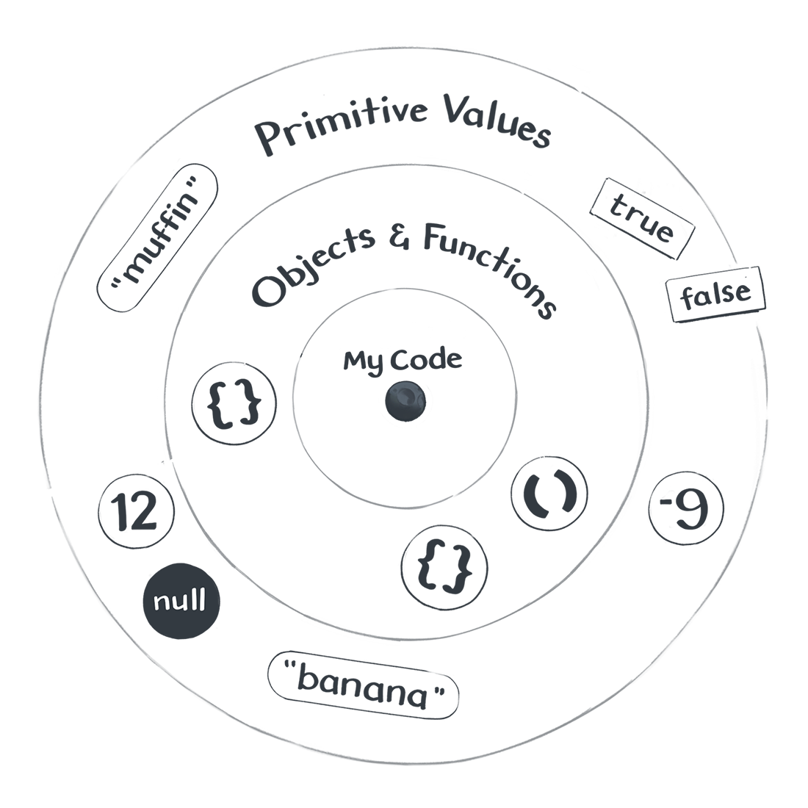
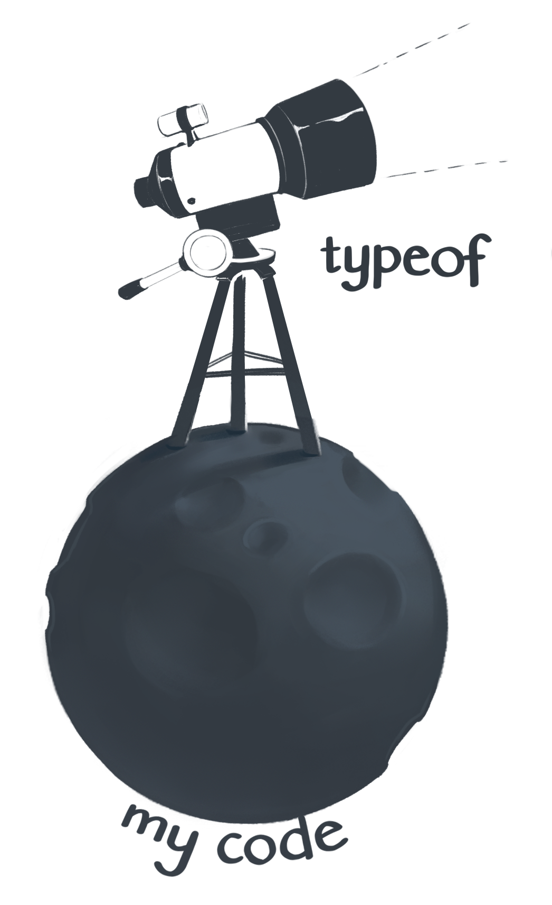

# Chương 2 - Vũ trụ JavaScript

*Giá trị là khởi nguồn của vạn vật...*

Giá trị là gì? Đây là một khái niệm khá khó để giải thích.

Một tọa độ trong hình học? Một từ trong ngôn ngữ loài người? Giá trị là một chủ đề cơ bản trong JavaScript - do đó chúng ta không thể định nghĩa nó bằng các thuật ngữ khác được. 

Thay vào đó, chúng ta sẽ định nghĩa nó thông qua các ví dụ cụ thể. Các con số và chuỗi là giá trị. Object và hàm cũng là giá trị.

Có rất nhiều thứ mà không phải là *giá trị*, chẳng hạn như câu điều kiện `if`, vòng lặp, khai báo biến,...

## Giá trị và Code

Một khái niệm hay bị nhầm lẫn mà chúng ta cần phải làm rõ khi bắt đầu xây dựng mô hình tư duy đó là: *giá trị* không phải là code. Chúng tồn tại tách biệt với code của chúng ta và 2 bên tương tác qua lại với nhau.

Để dễ phân biệt giá trị và code, tôi sẽ mượn bức ảnh minh họa trong cuốn Hoàng Tử Bé của Antoine de Saint-Exupery:

> Đoạn này tác giả sử dụng phong cách kể chuyện giống cuốn Hoàng Tử Bé.


Tôi là cậu bé đang đứng trên một hành tinh nhỏ, trên tay là một danh sách các chỉ dẫn. Danh sách đó đại diện cho đoạn code của tôi. Tôi đọc một lượt qua danh sách đó và nhận thấy có khá nhiều thứ đang diễn ra - có câu điều kiện `if`, có khai báo biến, có những dấu phẩy và dấu ngoặc nhọn.

Đoạn code của tôi chứa những chỉ dẫn như "gọi function này", "làm việc kia nhiều lần", hoặc thậm chí là "quẳng ra lỗi". Tôi đọc các chỉ dẫn đó, từng bước một, trên hành tinh bé nhỏ của tôi.

*Nhưng thi thoảng tôi vẫn ngước lên nhìn.*

Vào một đêm trăng sáng, tôi nhìn lên bầu trời JavaScriipt và thấy rất nhiều các giá trị ở đó: boolean, number, string, symbol, function và object, `null` và `undefined` - trời đất! Tôi có thể chạm vào chúng, nhưng chúng không hề tồn tại trong code của tôi.

*Trong vũ trụ JavaScript của chúng ta, các giá trị trôi nổi bồng bềnh trên không trung.*



"Khoan đã" - có thể bạn sẽ nghĩ, "Mình tưởng giá trị thì luôn phải ở trong code của mình chứ!?". Lúc này, tôi yêu cầu bạn phải hoàn toàn tin vào điều đó. Chúng ta sẽ cần một vào chương nữa để chứng minh điều đó. [Hãy cho nó 5 phút](https://signalvnoise.com/posts/3124-give-it-five-minutes). Tôi biết mình đang làm gì.

## Giá trị

Nhìn chung thì có tồn tại 2 loại giá trị.

### Giá trị nguyên thủy - Primitive value
**Giá trị nguyên thủy** giống như là những ngôi sao vậy - lạnh lẽo và xa xôi, nhưng chúng luôn ở quanh chúng ta khi cần. Thậm chí chúng ta có thể tìm và trỏ tới chúng từ trong code. Chúng có thể là number, string hay bất cứ giá trị nào khác. Tất cả các giá trị nguyên thủy đều sở hữu một tính chất chung: **luôn luôn bất biến trong vũ trụ JavaScript của chúng ta. Chúng ta có thể trỏ tới chúng, nhưng lại không thể tạo, phá hủy hay thay đổi chúng.**

Giờ hãy thử mở console trình duyệt của bạn lên và chạy đoạn mã sau:

```jsx
console.log(2);
console.log("hello");
console.log(undefined);
```

### Object và Function
**Object và Funnction** cũng là giá trị, nhưng khác với các giá trị nguyên thủy, **chúng ta hoàn toàn có thể thay đổi chúng bằng code của chúng ta.** Nếu ví giá trị nguyên thủy là những ngôi sao xa xôi thì object và function sẽ là những tiểu hành tinh trôi nổi. Chúng không nằm trong code của tôi, nhưng vẫn có thể thay đổi. 

```
Fun Fact 

Function chính là object nhưng có thêm một vài tính năng bổ sung khác, chúng ta gọi như vậy để tránh bị nhầm lẫn
```

Mở console trình duyệt lên và log những giá trị sau:
```jsx
console.log({});
console.log([]);
console.log(x => x * 2);
```

Thấy chúng được hiển thị khác biệt so với những giá trị nguyên thuỷ trước đó chứ? Tuỳ vào trình duyệt khác nhau thì chúng ta sẽ có những tương tác hoặc hiển thị khác nhau. Nếu bạn cài nhiều trình duyệt thì có thể thử so sánh sự khác biệt trong cách hiển thị object và function.

## Kiểu dữ liệu

Thoạt đầu, ta sẽ nghĩ rằng các giá trị trong vũ trụ JavaScript là giống hệt nhau - chỉ là những nốt sáng giữa bầu trời rộng lớn. Nhưng thực chất phía trên cao kia trôi nổi đầy những thứ khác nhau, và bởi vậy chúng ta sẽ cần một cách để phân loại chúng cho dễ học.

Chúng ta có thể chia các giá trị ra thành từng loại - giá trị cùng loại thì có các hành vi giống nhau. Bạn sẽ đóng vai là một nhà thiên văn học với đầy ý chí tham vọng, khát khao để khám phá ra *tất cả* mọi loại giá trị có thể quan sát được ở trên bầu trời JavaScript.

Sau gần 25 năm nghiên cứu, các nhà bác học chỉ tìm ra đượ 9 loại dữ liệu trong JavaScript:

### Giá trị nguyên thuỷ
- Undefined (`undefined`): giá trị mặc định nếu bạn quên gán giá trị (vô ý).
- Null (`null`): dùng khi bạn muốn gán giá trị rỗng (cố ý).
- Booleans (`true` và `false`): dùng cho toán tử logic.
- Numbers (`-100`, `3.14` và ...): dùng để tính toán.
- BigInts (ít sử dụng và còn mới): dùng để tính toán số cực lớn.
- Strings (`"hello"`, `"abracadabra"` và ...): dùng cho văn bản.
- Symbols (ít sử dụng): dùng để thêm key bí mật cho object.

### Object và Function
- Objects ({} và ...): dùng để nhóm dữ liệu và code liên quan với nhau
- Functions (x => x * 2 và ...): dùng để gọi tới các đoạn code

### Không còn kiểu nào khác
Có thể bạn sẽ thắc mắc rằng: "Thế còn các kiểu dữ liệu khác thì sao? Giống như array ấy?".

Trong JavaScript, không có kiểu dữ liệu nào khác ngoài các kiểu mà chúng ta đã liệt kê ở trên. Những thứ còn lại sẽ được coi là object hết! Ví dụ nhé như array, date, regex về cơ bản thì đều là object trong JavaScript:

```jsx
console.log(typeof([])); // "object"
console.log(typeof(new Date())); // "object"
console.log(typeof(/(hello|goodbye)/)); // "object"
```

```
Fun Fact

"Hmm hiểu rồi" - bạn đáp, "mọi thứ đều là object"! Trời ạ, thực sự có rất nhiều người truyền tai nhau điều đó nhưng nó hoàn toàn không chính xác chút nào.

Mặc dù đúng là khi chạy đoạn code như "hi".toUpperCase() sẽ khiến "hi" giống như 1 object nhưng đừng để bị lừa. Sự thật là JavaScript đã tạo một object tạm thời để thực thi, sau đó object sẽ bị loại bỏ ngay sau đó. Đừng lo nếu bạn cảm thấy khó hiểu về cơ chế này!

Điều bạn cần nhớ bây giờ đó là giá trị nguyên thuỷ (như string hoặc number) không phải là object.


```
### Kiểm tra kiểu

Chỉ có 9 kiểu dữ liệu thôi, vậy làm thế nào để ta xác định được chúng?


Nếu ta muốn kiểm tra kiểu của một giá trị, chúng ta có thể dùng toán tử `typeof`. Xem ví dụ ở phía dưới và thử ở console trình duyệt:
```jsx
console.log(typeof(2)); // "number"
console.log(typeof("hello")); // "string"
console.log(typeof(undefined)); // "undefined"
```
Đúng ra thì `typeof` không cần dùng ngoặc tròn. Ví dụ `typeof 2` và `typeof(2)` đều hoạt động. Tuy nhiên việc thêm ngoặc đôi khi sẽ giúp bạn tránh bị nhầm lẫn:
```jsx
console.log(typeof({})); // "object"
console.log(typeof([])); // "object"
console.log(typeof(x => x * 2)); // "function"
```

[INSERT WEJIO HERE]

Bạn có câu hỏi ư? Tốt! Nếu bạn hỏi một câu hỏi thì vũ trụ JavaScript sẽ trả lời, miễn là bạn biết cách hỏi.

## Expressions

Có rất nhiều câu hỏi mà JavaScript không thể trả lời được. Chẳng hạn như nếu bạn muốn biết liệu có nên thổ lộ cảm xúc với bff của bạn không hay tiếp tục chờ dợi cho tới khi cả hai biến thành bộ xương khô, JavaScript xin bó tay.

Nhưng bên cạnh đó thì có rất nhiều câu hỏi mà JavaScript sẵn lòng để trả lời. Những câu hỏi đó được gọi là `expressions` - các biểu thức.

Nếu chúng ta "hỏi" biểu thức như `2 + 2`, JavaScript sẽ "trả lời" với giá trị `4`.

```jsx
console.log(2 + 2); // 4
```

Một ví dụ nữa, nhớ typeof chứ? Đó cũng được coi là một expression đấy! Câu hỏi củ chúng ta sẽ là typeof(2) và vũ trụ javaScript sẽ trả lời là "number"

```jsx
console.log(typeof(2)); // "number"
```

Expression là những câu hỏi mà JavaScript có thể trả lời được và đáp án của chúng luôn là một giá trị.

[INSERT WEJIO HERE]

If the word “expression” confuses you, think of it as a piece of code that expresses a value. You might hear people say that 2 + 2 “results in” or “evaluates to” 4. These are all different ways to say the same thing.

We ask JavaScript 2 + 2, and it answers with 4. Expressions always result in a single value. Now we know enough about expressions to be dangerous!

## Tóm lại

Let’s recap what we know so far:

There are values, and then there’s code. We can think of values as different things “floating” in our JavaScript universe. They don’t exist inside our code, but we can refer to them from our code.
There are two categories of values: there are Primitive Values, and then there are Objects and Functions. In total, there are nine separate types. Each type serves a specific purpose, but some are rarely used.
Some values are lonely. For example, null is the only value of the Null type, and undefined is the only value of the Undefined type. As we will learn later, these two lonely values are quite the troublemakers!
We can ask questions with expressions. Expressions exist in our code, so they are not values. Rather, JavaScript will answer our expressions with values. For example, the 2 + 2 expression is answered with the value 4.
We can inspect the type of something by wrapping it in a typeof expression. For example, typeof(4) results in the string value "number".