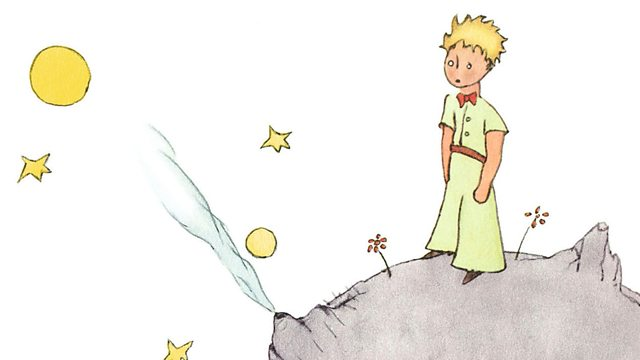

# Chương 2 - Vũ trụ JavaScript

*Giá trị là khởi nguồn của vạn vật...*

Giá trị là gì? Đây là một khái niệm khá khó để giải thích.

Một tọa độ trong hình học? Một từ trong ngôn ngữ loài người? Giá trị là một chủ đề cơ bản trong JavaScript - do đó chúng ta không thể định nghĩa nó bằng các thuật ngữ khác được. 

Thay vào đó, chúng ta sẽ định nghĩa nó thông qua các ví dụ cụ thể. Các con số và chuỗi là giá trị. Object và hàm cũng là giá trị.

Có rất nhiều thứ mà không phải là *giá trị*, chẳng hạn như câu điều kiện `if`, vòng lặp, khai báo biến,...

## Giá trị và Code

Một khái niệm hay bị nhầm lẫn mà chúng ta cần phải làm rõ khi bắt đầu xây dựng mô hình tư duy đó là: *giá trị* không phải là code. Chúng tồn tại tách biệt với code của chúng ta và 2 bên tương tác qua lại với nhau.

Để dễ phân biệt giá trị và code, tôi sẽ mượn bức ảnh minh họa trong cuốn Hoàng Tử Bé của Antoine de Saint-Exupery:

> Đoạn này tác giả sử dụng phong cách kể chuyện giống cuốn Hoàng Tử Bé.



Tôi là cậu bé đang đứng trên một hành tinh nhỏ, trên tay là một danh sách các chỉ dẫn. Danh sách đó đại diện cho đoạn code của tôi. Tôi đọc một lượt qua danh sách đó và nhận thấy có khá nhiều thứ đang diễn ra - có câu điều kiện `if`, có khai báo biến, có những dấu phẩy và dấu ngoặc nhọn.

Đoạn code của tôi chứa những chỉ dẫn như "gọi function này", "làm việc kia nhiều lần", hoặc thậm chí là "quẳng ra lỗi". Tôi đọc các chỉ dẫn đó, từng bước một, trên hành tinh bé nhỏ của tôi.

*Nhưng thi thoảng tôi vẫn ngước lên nhìn.*

Vào một đêm trăng sáng, tôi nhìn lên bầu trời JavaScriipt và thấy rất nhiều các giá trị ở đó: boolean, number, string, symbol, function và object, `null` và `undefined` - trời đất! Tôi có thể chạm vào chúng, nhưng chúng không hề tồn tại trong code của tôi.

*Trong vũ trụ JavaScript của chúng ta, các giá trị trôi nổi bồng bềnh trên không trung.*


"Khoan đã" - có thể bạn sẽ nghĩ, "Mình tưởng giá trị thì luôn phải ở trong code của mình chứ!?". Lúc này, tôi yêu cầu bạn phải hoàn toàn tin vào điều đó. Chúng ta sẽ cần một vào chương nữa để chứng minh điều đó. [Hãy cho nó 5 phút](https://signalvnoise.com/posts/3124-give-it-five-minutes). Tôi biết mình đang làm gì.

## Giá trị

Nhìn chung thì có tồn tại 2 loại giá trị.

### Giá trị nguyên thủy - Primitive value
**Giá trị nguyên thủy** giống như là những ngôi sao vậy - lạnh lẽo và xa xôi, nhưng chúng luôn ở quanh chúng ta khi cần. Thậm chí chúng ta có thể tìm và trỏ tới chúng từ trong code. Chúng có thể là number, string hay bất cứ giá trị nào khác. Tất cả các giá trị nguyên thủy đều sở hữu một tính chất chung: **luôn luôn bất biến trong vũ trụ JavaScript của chúng ta. Chúng ta có thể trỏ tới chúng, nhưng lại không thể tạo, phá hủy hay thay đổi chúng.**

Giờ hãy thử mở console trình duyệt của bạn lên và chạy đoạn mã sau:

```jsx
console.log(2);
console.log("hello");
console.log(undefined);
```

### Object và Function
**Object và Funnction** cũng là giá trị, nhưng khác với các giá trị nguyên thủy, **chúng ta hoàn toàn có thể thay đổi chúng bằng code của chúng ta.** Nếu ví giá trị nguyên thủy là những ngôi sao xa xôi thì object và function sẽ là những tiểu hành tinh trôi nổi quanh hành tinh của tôi. Chúng không nằm trong code của tôi, nhưng vẫn có thể bị thay đổi. 

```
Fun Fact 

Function chính là object nhưng có thêm một vài tính năng bổ sung khác
```

