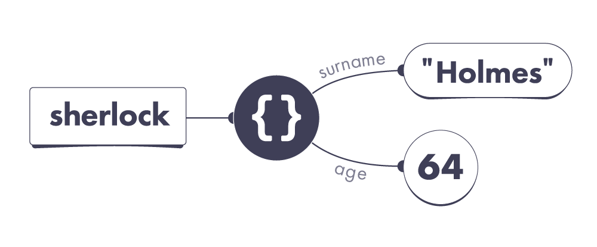

# Chương 8 - Thuộc tính

Hãy gặp gỡ Sherlock Holmes, một vị thám tử nổi tiếng toàn cầu đến từ thủ đô London:

```jsx
let sherlock = {
  surname: 'Holmes',
  address: { city: 'London' }
};
```

Cùng với đó là John Watson, một người bạn sống cùng anh ấy:

```jsx
let john = {
  surname: 'Watson',
  address: sherlock.address
};
```

Sherlock là một gã thám tử tài ba, nhưng lại là một người bạn cùng phòng kinh khủng. Một ngày nọ, John không chịu nổi nữa và quyết định - rời đến Malibu và thay đổi họ của anh ấy:

```jsx
john.surname = 'Lennon';
john.address.city = 'Malibu';
```

Đây sẽ là một bài tập nhỏ dành cho bạn. ****Hãy điền câu trả lời của bạn cho những câu hỏi phía dưới:****

```jsx
console.log(sherlock.surname); // ?
console.log(sherlock.address.city); // ?
console.log(john.surname); // ?
console.log(john.address.city); // ?
```

Trước khi đọc lại đoạn code một lần nữa, tôi muốn bạn trả lời câu hỏi bằng cách cụ thể như sau: hãy dùng giấy và bút để **vẽ lại cách suy nghĩ của bạn, những điều xảy ra trên từng dòng**. Đừng lo nếu bạn không biết cách để thể hiện nó trên giấy, đây là một chủ đề hoàn toàn mới, hãy sử dụng khả năng phán đoán của bạn.

Sau khi hoàn thành, hãy dùng bản vẽ đó để trả lời cho 4 câu hỏi phía trên.

---
Giờ hãy cùng kiểm tra đáp án của bạn:

💡 **Cả 2 đều có địa chỉ là Malibu** - đúng vậy, tôi không gõ nhầm đâu, thật là khó để thoát khỏi Sherlock phải không! Nếu bạn cho rằng `sherlock.address.city` là `“London”` thì mô hình tư duy của bạn đang không chính xác.

Để hiểu tại sao thì chúng ta cần phải học cách mà properties hoạt động trong vũ trụ JavaScript.

---
## Properties - Thuộc tính

Chúng ta đã từng nói về các object. Ví dụ, đây sẽ là một variable `sherlock`đang trỏ tới một giá trị object. Chúng ta tạo ra một object bằng các sử dụng `{}`**:**

```jsx
let sherlock = {};
```

Trong vũ trụ JavaScript của chúng ta thì nó sẽ trông như thế này:


Tuy nhiên, các object thường được sử dụng để nhóm các dữ liệu có liên quan với nhau. Ví dụ, chúng ta muốn nhóm các thông tin của Sherlock:

```jsx
let sherlock = {
  surname: 'Holmes',
  age: 64,
};
```

Ở đây, `sherlock` vẫn là một variable, nhưng `surname` và `age` lại không phải là variable. Chúng đã trở thành *property*. Khác với variable thì property sẽ luôn *nằm trong* một object cụ thể.

**Trong vũ trụ JavaScript của chúng ta, cả variable và property đều được ví như “những sợi dây”.** Tuy nhiên, những sợi dây của property sẽ bắt đầu từ object:



Ta có thể thấy **variable** `sherlock` đang trở tới một object. Object đó lại chứa **2 property**: `surname` trỏ tới giá trị chuỗi `“Holmes”` và `age` trỏ tới giá trị số `64`.

Một điều quan trọng đó là property không hề *chứa* giá trị - property trỏ tới chúng! Luôn nhớ trong đầu rằng vũ trụ của chúng ta được tạo bởi các sợi dây. Sợi dây sẽ được nối từ code của chúng ta (các variable) hoặc từ các object (các property). Tất cả sợi dây này đều có điểm đến là các giá trị.

Có thể trước đó bạn đã nhầm lẫn và nghĩ rằng giá trị thì phải “tồn tại” trong object bởi vì rõ ràng là đoạn code của nó xuất hiện “trong” object. Điều này dễ dẫn đến việc hiểu nhầm, bởi vậy thay vào đó ta sẽ ví chúng là “những sợi dây”. Giờ hãy nhìn lại đoạn code phía trên một lần nữa và đảm bảo rằng bạn đã hiểu nó trước khi tiếp tục chương này.

## Truy cập một Property

Chúng ta có thể lấy giá trị của một property bằng cách sử dụng dấu chấm (còn gọi là “dot notation”):

```jsx
console.log(sherlock.age); // 64
```

Ở đây, `sherlock.age` là một *expression* - một câu hỏi gửi tới vũ trụ JavaScript. Để trả lời câu hỏi đó, đầu tiên JavaScript sẽ đi theo sợi dây `sherlock`:

[Following the sherlock variable wire.webm](https://github.com/hminh2027/awesome-documentation-translation/assets/57801022/17798317-a4c2-4a3a-a6f1-8678c8840a5a)

Sợi dây dẫn tới một object. Từ object đó, JavaScript sẽ tiếp tục đi theo sợi dây property `age`. Property `age` này lại trỏ tới giá trị `64`, do đó `sherlock.age` sẽ là `64`.

## Tên Property

Một điều quan trọng nữa mà ta cần phải nhớ đó là ta không thể đặt 2 tên property giống nhau trong cùng một object. Ví dụ, object của ta sẽ không thể có 2 property `age`.

Tên property luôn phân biệt hoa-thường! Ví dụ, `age` và `Age` sẽ là 2 property khác nhau trong JavaScript.

Trong trường hợp ta không biết trước được tên của property để truy cập, ta có thể sử dụng `[]` (còn gọi là “bracket notation”) để truy cập trong object:

```jsx
let sherlock = { surname: 'Holmes', age: 64 };
let propertyName = prompt('What do you want to know?');
alert(sherlock[propertyName]); // Read property by its name
```

Thử chạy đoạn mã này ở console của trình duyệt và gõ `age` vào ô trống để hiểu rõ hơn.

## Gán giá trị cho property

Chuyện gì sẽ xảy ra nếu chúng ta *gán* một giá trị cho một property?

```jsx
sherlock.age = 65;
```

Để dễ hiểu thì ta sẽ chia đoạn code này thành 2 bên trái và phải, phân cách bởi dấu =.

**Đầu tiên ta sẽ xác định xem sợi dây nào đại diện cho phía bên trái: `sherlock.age`.**

Đi theo sợi dây `sherlock`, chọn sợi dây `age`:

[Following the age property wire on the left side.webm](https://github.com/hminh2027/awesome-documentation-translation/assets/57801022/456c4d34-9f3e-48b0-9ad6-4453758de4b2)

Lưu ý rằng chúng ta không đi theo sợi dây `age` tới `64` mà chỉ quan tâm sợi dây là `age` thôi. Ở phía bên trái trong một phép gán, chúng ta đang tìm **sợi dây**.

Nhớ sợi dây mà chúng ta chọn rồi chứ? Đi tiếp thôi.

**Tiếp theo, chúng ta sẽ xác định giá trị ở phía bên phải: `65`**

Trong một phép gán thì bên phải sẽ luôn là một *giá trị*. Ở ví dụ trên, giá trị bên phải là số `65`. Giờ thì hãy cùng triệu hồi nó:

[Evaluating the right side_ 65.webm](https://github.com/hminh2027/awesome-documentation-translation/assets/57801022/f99b1f56-1f61-4054-8436-d707c2734b70)

Giờ ta đã sẵn sàng để gán giá trị rồi.

Bước cuối cùng, chúng ta trỏ sợi dây bên trái tới giá trị bên phải:

[Changing the age property wire to 65.webm](https://github.com/hminh2027/awesome-documentation-translation/assets/57801022/7870656e-41fc-4beb-b359-177bff55ba8e)

Và hoàn tất! Từ giờ trở đi, `sherlock.age` sẽ có giá trị `65`

## Thiếu property

Có lẽ bạn sẽ thắc mắc rằng chuyện gì sẽ xảy ra nếu chúng ta truy cập một property mà nó chẳng hề tồn tại:

```jsx
let sherlock = { surname: 'Holmes', age: 64 };
console.log(sherlock.boat); // ?
```

Chúng ta đều biết rằng `sherlock.boat` là một expression, nhng liệu vũ trụ JavaScript có biết giá trị của nó để “trả lời” cho ta?

JavaScript thực chất sử dụng một bộ các quy tắc như sau:

1. Xác định giá trị của phần trước dấu chấm (`.`).
2. Nếu nó `null` hoặc `undefined`, quẳng ra lỗi.
3. Kiểm tra xem liệu nó có tồn tại trong object:
    1. Nếu có, trả về giá trị mà property đó trỏ tới.
    2. Nếu không, trả về giá trị undefined.

Những quy tắc trên hơi bị đơn giản hóa một chút, nhưng đại khái đó là cách mà JavaScript hoạt động! Ví dụ, `sherlock` trở tới object **không** có property `boat`. Vậy nên `sherlock.boat` sẽ là `undefined`:

```jsx
let sherlock = { surname: 'Holmes', age: 64 };
console.log(sherlock.boat); // undefined
```

Lưu ý rằng **điều này không có nghĩa** là object của ta có property `boat` trỏ tới `undefined`! Nó chỉ có 2 property kia thôi:


Bạn có thể nghĩ rằng `sherlock.boat` liên quan tới chủ đề property mà ta đang đi qua, nhưng **điều đó không hoàn toàn chính xác lắm**. Để trả lời một *câu hỏi* (expression) - JavaScript chỉ tuân thủ theo những quy tắc trên để trả lời chúng.

Nó tìm object mà `sherlock` trỏ tới, xác định rằng nó không chứa thuojc tính `boat`, và trả về giá trị `undefined`, đó là những gì bộ quy tắc nói. Không có lý do sâu xa nào cho việc đó cả: máy tính thì luôn tuân thủ các quy tắc.

> Thường thì các expression luôn cần trả về kết quả là các giá trị hoặc là lỗi. Một vài ngôn ngữ khác sẽ quẳng ra lỗi nếu bạn truy cập vào một property không tồn tại - nhưng JavaScript thì không!

Giờ là lúc luyện tập, hãy lướt lên trên và đọc lại bộ quy tắc một lần nữa rồi trả lời câu hỏi sau:

```jsx
let sherlock = { surname: 'Holmes', age: 64 };
console.log(sherlock.boat.name); // ?
```

Kết quả của đoạn code trên là gì? **Hãy thử làm theo quy tắc - đừng đoán!**

Gợi ý: có 2 dấu chấm ở đây, bạn sẽ cần thực hiện bộ quy tắc 2 lần.

---
💡 Đáp án sẽ là `sherlock.boat.name` quẳng ra lỗi:
- Đầu tiên ta xác định giá trị của `sherlock.boat`
 - Để làm thế, ta cần xác định giá trị của `sherlock`
  - Variable `sherlock` trở tới object
  - Do đó, giá trị của `sherlock` là object
 - Một object không phải là `null` hoặc `undefined`, đi tiếp
 - Object này không có property `boat`
 - Do đó, giá trị của `sherlock.boat` là `undefined`
- Chúng ta có `undefined` ở bên trái dấu chấm (`.`)
- Bộ quy tắc nói rằng `null` hoặc `undefined` bên trái sẽ bị lỗi

Nếu vẫn bị rối, hãy lướt lên trên và làm lại đúng theo bộ quy tắc đó.

---

## Tóm lại

- Property cũng giống như variable - đều là các sợi dây. Chúng đều trỏ tới giá trị, chỉ khác điểm xuất phát (property bắt đầu từ object)
- Một property luôn thuộc về một object cụ thể. Không được phép có 2 property trùng trên trong một object
- Gán giá trị theo 3 bước sau:
    1. Xác định dây phía bên trái
    2. Xác định giá trị phía bên phải
    3. Trỏ dây bên trái tới giá trị bên phải
- Một expression như `obj.property` thường được tính toán như sau:
    1. Xác định giá trị bên trái dấu chấm
    2. Nếu `null` hoặc `undefined`, quẳng ra lỗi
    3. Nếu property tồn tại thì trả về giá trị đang trỏ tới. Nếu không tồn tại thì trả về `undefined`
    
    Lưu ý rằng mô hình tư duy này có bị đôi chút đơn giản hóa. Tuy nhiên gần đó là đủ để bạn hiểu, bạn vẫn sẽ càn mở rộng kiến thức khi học sâu hơn về vũ trụ JavaScript.
    
    Nếu bạn bị bối rối bởi ví dụ Sherlock Holmes ở phần đầu thì hãy thử làm lại một lần nữa và sử dụng những kiến thức vừa rồi để trả lời nó. Ở chương tiếp theo sẽ có một ví dụ cụ thể hơn để chắc chắn rằng bạn đã hiểu cách hoạt động nó.
