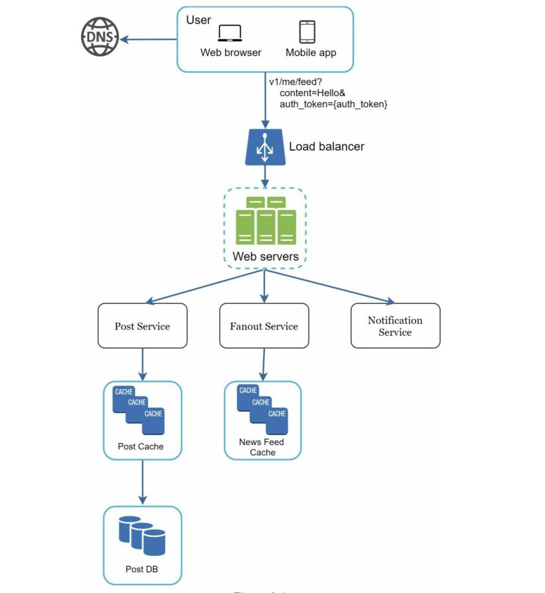
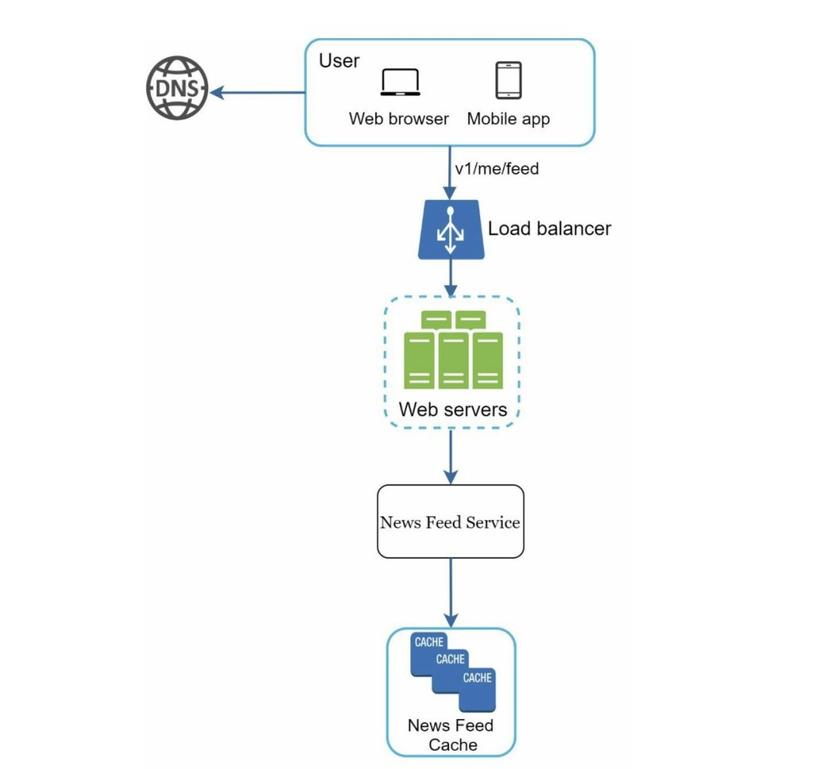
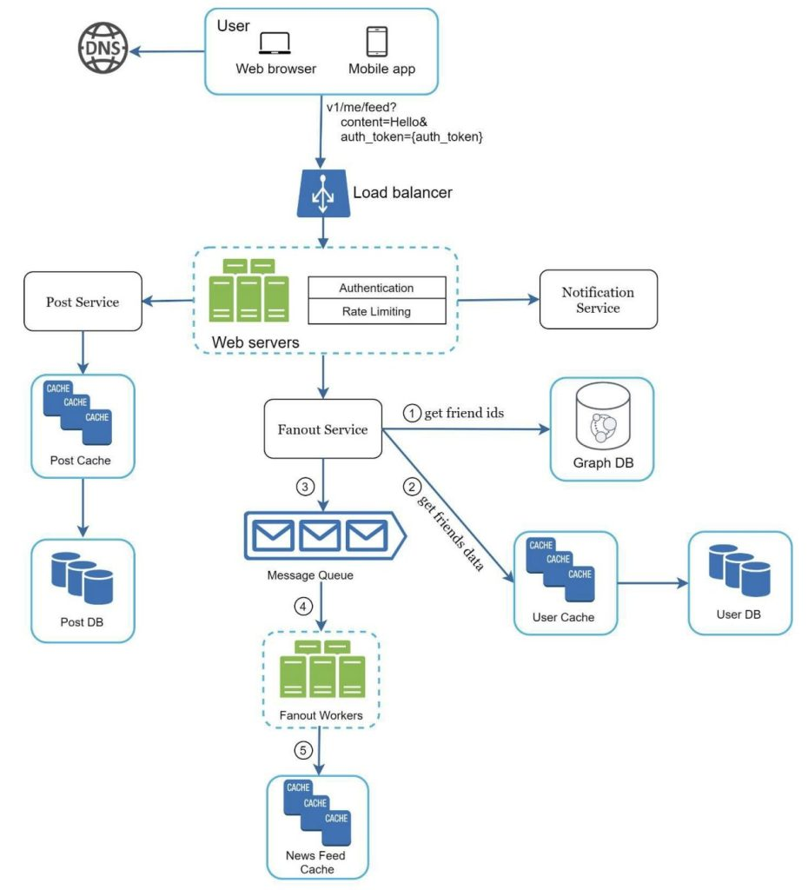
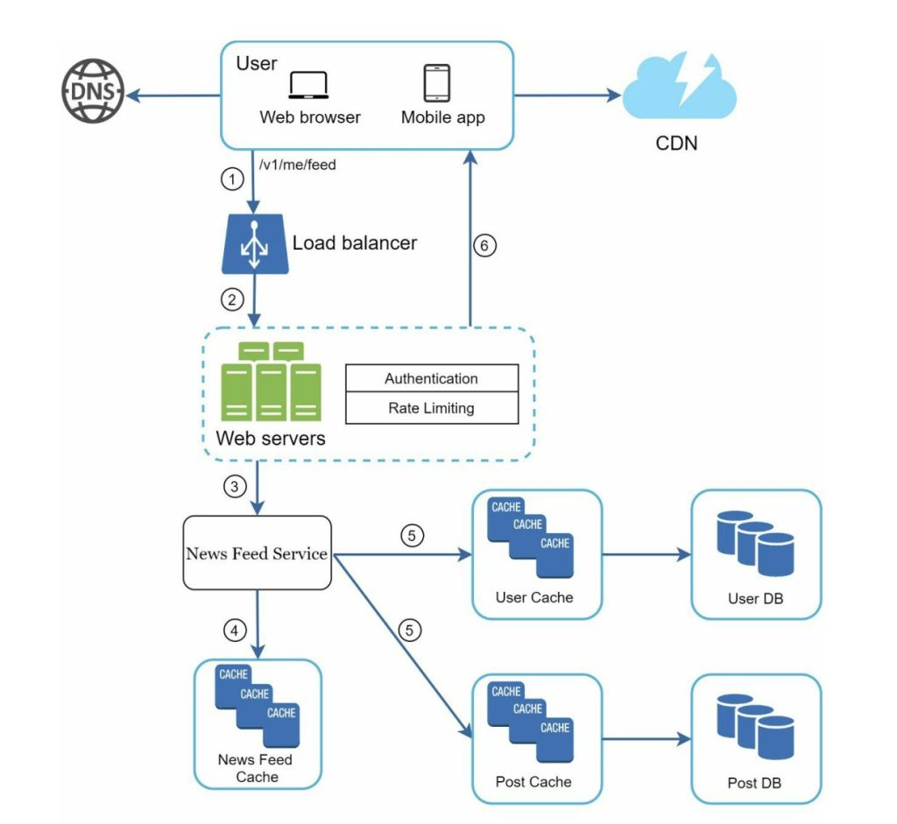

# Chương 3: Dàn ý chung cho các buổi phỏng vấn thiết kế hệ thống

Tưởng tượng rằng bạn vừa mới nhận được một lời mời phỏng vấn trực tiếp từ công ty mà bạn hàng mơ ước. Hôm đó hướng dẫn viên tuyển dụng gửi lịch trình của buổi phỏng vấn cho bạn. Bạn nhìn lướt qua danh sách đó và cảm thấy rằng mọi thứ hoàn toàn ổn, cho tới khi bạn đọc tới dòng chữ: **Phỏng Vấn Thiết Kế Hệ Thống**.

Các cuộc phỏng vấn thiết kế hệ thống thường khá là đáng sợ. Yêu cầu của có thể mơ hồ như “hãy thiết kế một sản phẩm X nổi tiếng?”. Các câu hỏi như vậy nghe thường mang vẻ rất bao la rộng lớn và nó thiếu sự rõ ràng một cách vô lý. Tới đây có lẽ bạn sẽ cảm thấy nản lòng và tôi hoàn toàn hiểu được điều đó. Xét cho cùng, làm sao mà một người có thể thiết kế lại một sản phẩm nổi tiếng đã được xây dựng bởi hàng trăm, thậm chí là hàng ngàn kỹ sư - chỉ trong một giờ?

Tin tốt cho bạn là chẳng ai đòi hỏi bạn phải làm vậy cả. Thiết kế một hệ thống thực tế vốn dĩ rất phức tạp. Ta có thể lấy ví dụ như hệ thống tìm kiếm của Google, nhìn thoạt qua thì trông có vẻ đơn giản nhưng thực chất số lượng công nghệ mà nó sử dụng sẽ khiến bạn phải há hốc mồm đấy. Vậy nếu mục đích không phải là thiết kế một hệ thống trong vòng một giờ đồng hồ thì rốt cuộc buổi phỏng vấn này có tác dụng gì?

Thực chất buổi phỏng vấn thiết kế hệ thống là để mô phỏng lại tình huống khi mà cả bạn và đồng nghiệp của bạn cùng phải đối mặt với một bài toán khá mơ hồ, sau đó cả hai sẽ phải cùng nhau làm việc và đưa ra lời giải hợp lý. Bài toán đó sẽ có vô số cách giải quyết và không có lời giải nào là hoàn hảo cả. Thậm chí là cái lời giải cuối cùng của bài toán đó cũng không quan trọng bằng quá trình giải của bạn. Nó sẽ cho phép bạn thể hiện khả năng thiết kế của mình, tự do bảo vệ các luận điểm và phản hồi bằng các câu trả lời mang tính xây dựng.

Giờ chúng ta sẽ thử đảo vị trí một chút và cùng phân tích xem người phỏng bạn sẽ nghĩ những gì khi cô ấy bước vào phòng họp để gặp bạn nhé. Mục đích chính của nhà tuyển dụng là phải đánh giá được chính xác các khả năng mà bạn có. Nếu buổi phỏng vấn không diễn ra tốt như mong đợi, cô ấy sẽ buộc phải đánh giá rằng bạn chưa đủ năng lực hoặc thiếu sự thuyết phục. Vậy thì nhà tuyển dụng đang mong đợi điều gì trong một buổi phỏng vấn thiết kế hệ thống?

Rất nhiều người nghĩ rằng buổi phỏng vấn đó tập trung vào kĩ năng thiết kế về mặt kĩ thuật của người đó. Nhưng như vậy là chưa đủ. Để có một buổi phỏng vấn chất lượng thì họ phải thể hiện được rõ cả những kĩ năng như làm việc nhóm, làm việc trong môi trường áp lực và xây dựng giải pháp cho vấn đề.

Một nhà tuyển dụng chuyên nghiệp cũng sẽ để ý tới các red-flag. Chẳng hạn như over-engineering, một thảm hoạ thực sự mà rất nhiều các kĩ sư mắc phải khi họ chỉ quan tâm tới việc thiết kế và ngó lơ những trade-off của chúng. Họ thường không nhận ra rằng các hệ thống bị over-engineer đã tiêu tốn nhiều chi phí như thế nào, rằng đã có rất nhiều các công ty phải trả cái giá rất đắt cho việc bỏ qua điều đó. Tôi tin rằng bạn sẽ không muốn thể hiện điều đó trong một buổi phỏng vấn thiết kế hệ thống đâu. Ngoài ra, bạn nên chú ý tới những red-flag khác như tư duy bảo thủ hoặc không chịu tiếp thu ý kiến từ người khác, v..v..

Trong chương này, chúng ta sẽ cùng nhau đi qua một vài mẹo hữu dụng và cùng làm quen với một dàn ý đơn giản - hiệu quả để áp dụng trong buổi phỏng vấn thiết kế hệ thống nhé.

## Quy trình hiệu quả gồm 4 bước

Không có buổi phỏng vấn nào là giống buổi phỏng vấn nào cả. Các buổi phỏng vấn thiết kế hệ thống đều có tính chất mở (open-ended), do đó sẽ không có đáp án hay giải pháp nào có thể áp dụng cho tất cả. Tuy nhiên, ta vẫn có thể rút ra được các bước cơ bản mà ta có thể tái sử dụng được trong các buổi phỏng vấn như sau. 

## Bước 1 - Hiểu rõ vấn đề và xác định phạm vi thiết kế

“Ai cho cô biết tại sao con hổ lại gầm?”

Một cách tay vút lên ở phía cuối lớp.

“Mời Jimmy” - cô giáo nói

“Thưa cô bởi vì con hổ đó đang ĐÓI”

“Rất tốt Jimmy”

Xuyên suốt thời thơ ấu của Jimmy, cậu luôn là đứa trẻ đầu tiên trả lời các câu hỏi ở trong lớp. Bất cứ khi nào cô giáo đặt ra một câu hỏi, sẽ luôn luôn có một đứa trẻ trong lớp thích trả lời bất kể việc cậu có biết đáp án hay không. Đó chính là Jimmy.

Jimmy được biết đến là một học sinh xuất sắc. Cậu tự hào vì luôn trả lời các câu hỏi một cách nhanh chóng. Trong các bài kiểm tra, cậu luôn là người đầu tiên hoàn thành. Cậu là lựa chọn đầu tiên của thầy cô giáo mỗi khi có bất kì một cuộc thi nào ở trường.

ĐỪNG học theo Jimmy.

Trong buổi phỏng vấn thiết kế hệ thống, việc bạn đưa ra câu trả lời nhanh sẽ không mang lại cho bạn bất cứ lợi thế nào cả. Thậm chí việc trả lời bừa mà không hiểu rõ các yêu cầu của câu hỏi sẽ là một điểm trừ lớn trong mắt của nhà tuyển dụng, bởi vốn dĩ đây không phải là một cuộc thi đố. Không có câu trả lời nào là chính xác cả.

Do đó, đừng có hấp tấp mà đưa ra ngay một giải pháp. Sống chậm lại một chút. Việc bạn cần làm là suy nghĩ thật kĩ và đặt ra những câu hỏi cần thiết để làm rõ các yêu cầu và giả định. Điều này là cực kì quan trọng.

Là một kĩ sư, chúng ta thường thích giải quyết các bài toán khó bằng và nhảy trực tiếp vào việc thiết kế giải pháp, tuy nhiên cách tiếp cận này có thể dẫn bạn đến việc thiết kế nhầm hệ thống. Một trong những kĩ năng quan trọng nhất của một kĩ sư đó là đặt ra những câu hỏi chính xác, đưa ra các giả định hợp lý và thu thập toàn bộ thông tin cần thiết để xây một hệ thống. Bởi vậy đừng bao giờ ngại đặt câu hỏi.

Khi bạn đặt một câu hỏi, nhà tuyển có thể sẽ trả lời trực tiếp câu hỏi của bạn hoặc là họ sẽ hỏi ngược lại và yêu cầu bạn phải đưa ra các giả định của mình. Nếu điều đó xảy ra, hãy ghi lại các giả định đó lên bảng hoặc ra giấy, bởi vì bạn sẽ cần đến chúng đấy.

Vậy thì chúng ta nên đặt câu hỏi như thế nào? Hãy hỏi những câu mà giúp chúng ta hiểu chính xác đề bài đang yêu cầu gì. Dưới đây sẽ là danh sách một vài câu hỏi mà bạn có thể tham khảo:

- Chúng ta đang cần xây dựng những tính năng cụ thể nào?
- Có bao nhiêu người dùng sản phẩm này?
- Công ty dự tính tốc tăng trưởng như thế nào? Cụ thể trong vòng 3 tháng, 6 tháng và 1 năm?
- Tech stack của công ty là gì? Những service sẵn có nào mà bạn có thể tận dụng để giúp việc thiết kế đơn giản hơn?

### **Ví dụ**

Giả sử nếu đề bài là thiết kế một hệ thống newsfeed và bạn muốn đặt câu hỏi để làm rõ các yêu cầu. Cuộc trò giữa bạn và nhà tuyển dụng có thể diễn ra như sau:

**Thí sinh (TS)**: Đây là mobile app hay web app? Hay cả 2?

**Nhà tuyển dụng (NTD)**: Cả hai

**TS**: Những tính năng nào được coi là quan trọng nhất của sản phẩm này?

**NTD**: Cho phép tạo bài viết và xem những bài viết của bạn bè

**TS**: Thứ tự sắp xếp các bài viết theo thời gian hay theo một yếu tố cụ thể? Nghĩa là mỗi bài viết sẽ có một số “cân nặng” nhất định (ví dụ các bài viết từ bạn bè thân thiết của bạn sẽ “nặng” hơn các bài viết trong group)

**NTD**: Để đơn giản thì ta sẽ sắp xếp theo thời gian

**TS**: Một user được phép có tối đa bao nhiêu bạn bè?

**NTD**: 5000

**TS**: Lượng truy cập là bao nhiêu?

**NTD**: 10 triệu người dùng hàng ngày (Daily Active Users)

**TS**: Bài viết có chứa hình ảnh, video hay chỉ chứa text thôi?

**NTD**: Nó có thể chứa các file media, tức là cả ảnh và video

Đó là đoạn hội thoại mẫu giữa bạn và nhà tuyển dụng. Có thể thấy rằng việc hiểu rõ các yêu cầu của hệ thống và làm sáng tỏ chúng là rất quan trọng.

## Bước 2 - Đề xuất thiết kế cấp cao

Ở bước này chúng ta sẽ tập trung vào việc xây dựng một bản thiết kế cấp cao (high-level design) nhằm thuyết phục được nhà tuyển dụng. Bởi vậy việc hợp tác với nhà tuyển dụng trong quá trình thiết kế sẽ là một ý tưởng rất thông minh.

- Đầu tiên bạn cần nghĩ ra một bản phác thảo thiết kế của hệ thống, sau đó nhờ nhà tuyển dụng đánh giá nó. Hãy coi họ như một người đồng nghiệp đang làm cùng team với bạn. Rất nhiều nhà tuyển dụng thích trò chuyện và tham gia vào việc thiết kế đấy
- Tiếp theo, hãy vẽ lên bảng hoặc ra giấy sơ đồ gồm các thành phần chính của hệ thống. Nó có thể bao gồm những thứ như client (mobile/web), APIs, web servers, data store, cache, CDN, message queue, …
- Cuối cùng là thực hiện các phép tính nhẩm nhanh nhằm ước lượng xem liệu bản phác đó có có đáp ứng được khi mở rộng hệ thống hay không. Và đừng quên, hãy làm các phép tính đó một cách công khai để nhà tuyển dụng biết

Nếu có thể, hãy đi qua một vài use case cụ thể. Việc đó sẽ giúp bạn dễ định hình được bản thiết kế cấp cao và không bị bỏ sót các edge case mà bạn chưa tính đến.

Vậy bản thiết kế cấp cao này có nên chứa các API endpoint và database schema trong? Điều đó còn phụ thuộc vào bài toán mà bạn đang gặp phải. Nếu nó là một hệ thống lớn như “Thiết kế công cụ tìm kiếm Google” thì việc đó hơi low-level. Còn nếu nó chỉ là một hệ thống backend phục vụ cho trò Poker multi-player thì việc đó có thể chấp nhận được. Để chắc chắn thì hãy trao đổi thẳng với nhà tuyển dụng của bạn.

### Ví dụ

Ta sẽ cùng xây dựng một bản thiết kế cấp cao với bài toán hồi nãy: “Thiết kế một hệ thống newsfeed”. Tạm thời bạn không cần phải hiểu cách mà hệ thống này thực sự hoạt động, chúng ta sẽ nói rõ hơn về nó ở chương 11.

Trong thiết kế cấp cao, hệ thống này sẽ được chia làm 2 luồng chính: publish bài viết và xây dựng newsfeed.

- Publish bài viết: khi một user đăng tải một bài viết, các dữ liệu tương ứng sẽ được lưu vào trong cache/database và bài viết đó sẽ được hiển thị trên newsfeed của bạn bè
- Xây dựng newsfeed: newsfeed sẽ được xây dựng bằng cách tổng hợp lại các bài viết của bạn bè user và hiển thị theo thứ tự thời gian

Hình 3-1 và 3-2 dưới đây lần lượt đại diện cho bản thiết kế cấp cao của 2 luồng chính kia.

## Bước 3 - Thiết kế chi tiết

Ở bước này, hãy chắc chắn rằng bạn và nhà tuyển dụng đã cùng nhau đạt được những điều sau:

- Thống nhất về các mục tiêu tổng quát và phạm vi của tính năng
- Phác thảo ra bản thiết kế cấp cao
- Thu thập nhận xét/phản hồi của nhà tuyển dụng về bản thiết kế cấp cao
- Dựa vào những phản hồi trên, xác định những phần mà mình cần phải tập trung vào

Bạn sẽ cùng nhà tuyển dụng xác định xem đâu sẽ là những thành phần kiến trúc quan trọng mà ta cần phải ưu tiên. Và đặc biệt nhấn mạnh lần nữa rằng, không có buổi phỏng vấn nào là giống nhau cả. Đôi lúc nhà tuyển dụng có thể gợi ý rằng họ muốn tập trung vào bản thiết kế cấp cao, đôi lúc họ lại muốn thảo luận về các đặc điểm liên quan tới hiệu suất của hệ thống (nếu bạn là senior), tập trung vào các yếu điểm và ước lượng tài nguyên của hệ thống. Tuy nhiên đa số các nhà tuyển dụng sẽ muốn bạn đi sâu vào chi tiết của một vài thành phần cụ thể trong hệ thống. Ví dụ đối với hệ thống rút gọn URL ta có thể đi sâu vào việc thiết kế một hàm băm để biến một URL dài thành ngắn, hoặc đối với hệ thống chat thì có thể đi sâu vào việc giảm độ trễ của hệ thống hoặc cách để làm tính năng online/offline.

Quản lý thời gian cũng tương đối quan trọng trong buổi phỏng vấn bởi bạn sẽ rất dễ bị cuốn vào những việc gây lãng phí thời gian của mình. Bạn phải thể hiện được kĩ năng của mình cho nhà tuyển dụng thấy, bởi vậy đừng quá đi sâu vào những chi tiết thừa thãi. Ví dụ, việc bạn ngồi ba hoa về thuật toán EdgeRank đánh giá bài viết của Facebook có lẽ sẽ tiêu tốn kha khá lượng thời gian quý báu của bạn trong buổi phỏng vấn và không thể hiện được rằng bạn có thể thiết kế một hệ thống mở rộng tốt.

### Ví dụ

Cho tới lúc này, chúng ta đã cùng nhau thảo luận về thiết kế cấp cao của hệ thống newsfeed vừa rồi và ta sẽ cho rằng nhà tuyển dụng thích nó. Bây giờ thì việc của ta là đào sâu vào 2 use-case quan trọng nhất:

1. Publish bài viết
2. Xây dựng newsfeed

Hình 3-3 và 3-4 bên dưới sẽ là 2 bản thiết kế chi tiết cho 2 use-case trên, chúng sẽ được giải thích kĩ hơn ở chương 11.

## Bước 4 - Tổng kết

Ở bước cuối cùng này, nhà tuyển dụng có thể hỏi thêm các câu hỏi về những thiết kế trên kia hoặc họ cho bạn tự do thảo luận về các vấn đề ngoài lề. Dưới đây sẽ là một số tình huống giả định mà bạn có thể tham khảo:

- Nhà tuyển dụng sẽ muốn bạn xác định điểm yếu của hệ thống và thảo luận về cách để có thể cải thiện nó. Đừng bao giờ khẳng định rằng thiết kế của bạn là hoàn hảo và không cần cải thiện nào, bởi sẽ luôn luôn có thứ cần cải thiện. Và đây sẽ là một cơ hội tốt để thể hiện rằng bạn là người có tư duy phản biện
- Bạn cũng có thể tóm tắt lại bản thiết kế của mình cho nhà tuyển dụng. Điều này khá quan trọng nếu bạn vừa đề xuất một vài giải pháp cho hệ thống. Việc tóm tắt sẽ giúp cho nhà tuyển dụng nắm rõ hơn về hệ thống của bạn, đặc biệt là sau khi ta vừa trải qua một khoảng thời gian dài thiết kế
- Error-case (lỗi server, mất mạng, …) cũng là một chủ đề hay để nói
- Các vấn đề về Operation cũng khá thú vị. Hãy nói về cách bạn quản lý các số liệu và các error log. Bạn roll out hệ thống như thế nào?
- Cách để mở rộng hệ thống, chẳng hạn như từ 1 triệu user lên 10 triệu user thì bạn sẽ thay đổi những gì?
- Đề xuất thêm các cách cải thiện hệ thống nếu bạn còn thời gian

Để tổng kết lại thì chúng ta sẽ có 1 danh sách gồm những việc Nên và Không Nên nhé.

### Nên

- Luôn đặt câu hỏi để làm rõ. Đừng tự suy diễn rồi cho mình là đúng.
- Hiểu rõ các yêu cầu bài toán
- Không có câu trả lời nào là đúng và hoàn hảo nhất cả. Giải pháp cho một công ty mới startup sẽ khác với giải pháp cho công ty lâu đời với hàng triệu nhân viên. Hãy chắn chắn rằng bạn hiểu rõ yêu cầu của hệ thống
- Luôn để cho nhà tuyển dụng biết bạn đang nghĩ gì. Đừng quên giao tiếp với họ
- Đưa ra nhiều cách tiếp cận khác nhau nếu được
- Sau khi thống nhất với nhà tuyển dụng về bản thiết kế phác thảo, hãy đi sâu vào chi tiết từng thành phần của nó. Ưu tiên thiết kế cái quan trọng trước
- Luôn hỏi ý kiến của nhà tuyển dụng về các ý tưởng của bạn. Một nhà tuyển dụng tốt sẽ làm việc với bạn như đồng nghiệp vậy
- Đừng bao giờ bỏ cuộc!

### Không Nên

- Thiếu sự chuẩn bị trước đối với những câu hỏi dễ gặp
- Nhảy thẳng vào giải pháp mà không làm rõ yêu cầu bài toán cũng như các giả định
- Đi quá sâu vào chi tiết của một phần nào đó khi vừa bắt đầu buổi phỏng vấn. Làm bản thiết kế cấp cao trước, sau đó đi sâu sau
- Ngại đặt câu hỏi nếu bị mắc
- Im lặng và tránh giao tiếp
- Nghĩ rằng thiết kế xong là xong, bạn luôn cần hỏi ý kiến của nhà tuyển dụng

### Ước lượng thời gian cho từng bước

Các câu hỏi của buổi phỏng vấn thiết kế hệ thống thường rất rộng và trong khoảnh 45p - 1 tiếng thì khó mà đi hết được toàn bộ thiết kế. Do đó việc quản lý thời gian là rất quan trọng. Vậy ta nên chia thời gian cho từng phần như thế nào? Phía dưới đây sẽ là một ví dụ về phân chia khoảng thời gian cho một buổi phỏng vấn 45 phút. Lưu ý rằng đây chỉ mang tính chất tham khảo, các mốc này có thể thay đổi dựa theo phạm vi của bài toán và yêu cầu của nhà tuyển dụng:

- Bước 1: từ 3-10 phút
- Bước 2: từ 10-15 phút
- Bước 3: từ 10-25 phút
- Bước 4: từ 3-5 phút