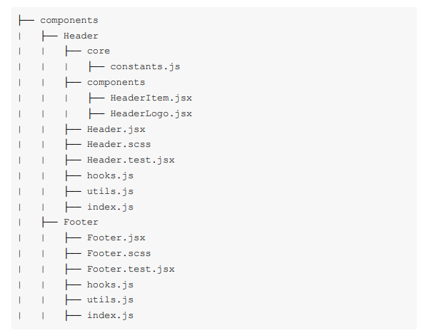
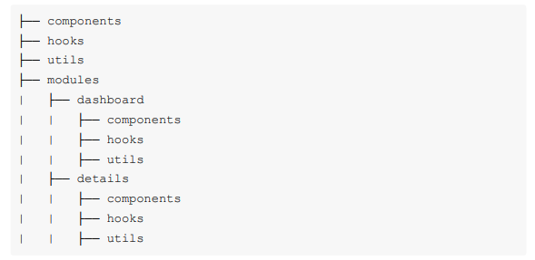
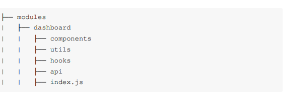

# 1. Cấu trúc của dự án

- **Sử dụng có Common module**
- **Sử dụng Absolute Path (setup alisas/prefix)**
- **Tách từng component ra folder riêng**
    - Bên trong gồm: file component, file test, file style, file hook, …
    - Có thể dùng file index để export riêng component cho gọn
        
        
        
- **Nhóm các component theo từng module/route**
    - Nhìn structure là biết ứng dụng đang làm gì → thân thiện với dev, tăng tốc độ code
    - Những đoạn code nào được tái sử dụng ở 2 module khác nhau thì sẽ được lưu ở module cha của chúng (tưởng tượng như tree)
        
        
        
    - Naming convention: pages | modules | screens (advised)
- **Cách quản lý module import lẫn nhau**
    - Nếu một module cần code/component ở module khác thì có 2 cách xử lý:
        - Một là đưa nó lên module cha → các con import từ cha
        - Hai là tạo code/component ý hệt và copy sang
    - Việc tái sử dụng quá nhiều hoặc cố làm cho component generic sẽ khiến cho component đó trở nên phức tạp, vì vậy chỉ tái sử dụng nếu có quá nhiều code bị lặp
    - Nếu team nhiều người thì giao tiếp + code review là cần thiết để xác định code tái sử dụng
- **Bọc các component/code đến từ bên ngoài**
    - Sử dụng các thư viện component hoặc api bên ngoài sẽ khiến app bị phụ thuộc vào nó, dễ bị ảnh hưởng bởi thay đổi trong tương lai
        - Sử dụng adapter/wrapper/custom component để hạn chế phải thay đổi nhiều chỗ trong tương lai
            - adapter/wrapper/custom: format, chọn lọc, thêm/bớt tính năng của component theo ý muốn để phù hợp với use-case
        - Nôm na là biến của nó thành của mình, hạn chế sự lệ thuộc và thay đổi nhiều khi nó thay đổi
- **Cách thiết kế một Module**
    - Phân tích dựa trên nghiệp vụ hệ thống
        - Vd: e-commerce sẽ có product, home,…
    - Không cần tạo thêm folder module này để làm cho nó giống hệt structure module khác
        
      
        
- **Cấu trúc dự án nên nói lên tất cả (chủ đề của hệ thống)**
- **Nên đặt mọi thứ về nơi mà chúng hay được sử dụng**
    - Nếu 2 - n module dùng chung component → move nó lên module cha chứa chúng
    - Tránh đặt mọi thứ tái sử dụng lên root module (globally)
- **Không đặt business logic vào các utility functions**
    - Xác định đầu vào - đầu ra rõ ràng để tái sử dụng tốt
    - Nếu muốn handle business logic → tạo trong folder “api”
- **Tách business logic khỏi UI**
    - Nên tách logic phức tạp (gọi api, validate, …) ra thành custom hook riêng
    - Nếu logic đơn giản thì có thể viết trong component cũng ok
- **Module nên chứa route của chính nó**
    - Cách thông thường: khai báo toàn bọ routes trong 1 file
        - Khiến kích cỡ file quá lớn
        - Dễ xung đột nếu nhiều người cùng sửa file đó
    - Nên tách nhỏ route nằm trong từng module → dễ quản lý
- **Tránh một context cho cả app**
- **Tự xây dựng thư viện**
    - Thường trong dự án giữa nhiều team thì ta thường tách các component và function hay tái sử dụng ra và … tạo thành thư viên riêng rồi đưa lên NPM (MVTP libs, jinx lib, …)
        - Mục đích để dev dễ cài đặt
        - Phục vụ đúng use-case cụ thể của dự án
    - Nếu không có thời gian thì dùng thư viện, tool bên ngoài rồi custom
- **Chạy App bằng 1 lệnh duy nhất**