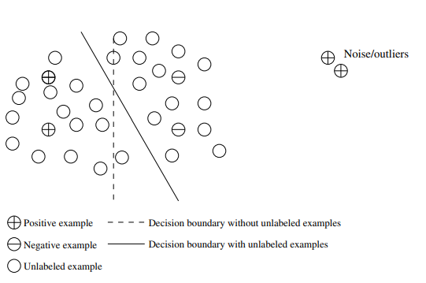

_Original document: [here](pdf/Data-Mining-Concepts-and-Techniques-3rd-Ed.pdf)_

_Trạng thái phiên dịch: **đang dịch**_

# Các công nghệ nào được sử dụng?

Là một nghiệp vụ hướng ứng dụng cao, khai phá dữ liệu đã kết hợp nhiều kỹ thuật từ các lĩnh vực khác như thống kê, học máy, nhận diện mẫu, các hệ thống cơ sở dữ liệu và kho dữ liệu, truy xuất thông tin, trực quan hóa, các thuật toán, các máy tính hiệu xuất cao (HPC) và nhiều nghiệp vụ ứng dụng khác với nhau. Tính chất liên ngành của nghiên cứu và phát triển khai phá dữ liệu đóng góp đáng kể vào thành công của khai phá dữ liệu nói chung và các ứng dụng mở rộng của nó nói riêng. Trong phần này, chúng ta sẽ cùng đưa ra các ví dụ về một số ngành có ảnh hưởng mạnh mẽ đến sự phát triển của các phương pháp khai phá dữ liệu.

## Thống kê

## Học máy

### Học có giám sát

**Học có giám sát** hay còn có thể gọi theo một khái niệm dễ hiệu hơn là sự phân loại. Sự giám sát hay sự phân loại đó được thể hiện ở chỗ các ví dụ (examples) dùng để đào tạo (training) sẽ được dán nhãn phân biệt.

Ví dụ, trong bài toán nhận dạng mã bưu chính, các hình ảnh mã bưu chính được viết bằng tay và các bản dịch tương ứng mà máy có khả năng đọc được sẽ được sử dụng làm ví dụ đào tạo (training examples) để giám sát việc học của mô hình (model) phân loại

### Học không giám sát

**Học có giám sát** hay còn có thể gọi theo một khái niệm khác là sự phân cụm (clustering). Quá trình học sẽ không có sự giám sát bởi vì các ví dụ đầu vào không được gắn nhãn lớp. Và thường thì chúng ta có thể dùng kỹ thuật phân cụm để khai phá các lớp bên trong dữ liệu.

Ví dụ, một phương pháp **học không giám sát** có thể lấy một tập hợp gồm các ảnh và chữ số viết tay làm đầu vào. Giả sử nó tìm thấy 10 cụm (clusters) dữ liệu, chúng tương ứng với 10 chữ số lần lượt từ 0 tới 9. Nhưng bởi vì các dữ liệu dùng để đào tạo không được gắn nhãn nên các mô hình (model) dù đã được học từ trước nhưng lại không thể cho chúng ta biết được ý nghĩa của các cụm đó.

### Học nửa giám sát

**Học nửa giám sát** là một lớp của các kỹ thuật học máy với khả năng dùng được cả các ví dụ dán nhãn lẫn chưa dán nhãn khi học một mô hình. Cách tiếp cận đó là các ví dụ được dán nhãn sẽ được sử dụng để thiết lập lại các ranh giới giữa các lớp. Đối với bài toán hai-lớp, chúng ta có thể coi tập hợp các ví dụ thuộc về một lớp là các ví dụ tích cực, thuộc về lớp còn lại sẽ là các ví dụ tiêu cực.

Trong hình 1.12, bỏ qua các ví dụ không dán nhãn thì các đường đứt nét là danh giới quyết định phân tách tốt nhất giữa các ví dụ tích cực và các ví dụ tiêu cực. Chúng ta có thể sử dụng các ví dụ không dán nhãn để thiết lập lại danh giới quyết dịnh thành đường liền nét. Hơn nữa, chúng ta có thể phát hiện ra có 2 ví dụ tích cực ở góc trên bên phải màn hình, dù đã được gán nhãn một ví dụ

### Học chủ động

Học chủ động là một phương pháp học máy cho phép người dùng đóng một vai trò chủ động trong quá trình học. Một phương pháp chủ động học có thể yêu cầu một người dùng dán nhãn cho một ví dụ từ các ví dụ chưa dán nhãn hoặc từ nguồn tổng hợp bởi chương trình học. Mục tiêu là để tối ưu hóa chất lượng mô hình bằng cách tích cực thu thập kiến thức từ người dùng, với hạn chế đi kèm đó là số lượng ví dụ để yêu cầu họ gán nhãn sẽ bị giới hạn.

Bạn có thể nhận thấy có rất nhiều điểm chung giữa khai phá giữ liệu và học máy. Đối với các nhiệm vụ phân loại (classification) và phân cụm (clustering), nghiên cứu về học máy thường tập trung vào độ chính xác của mô hình. Ngoài độ chính xác, nghiên cứu khai phá dữ liệu còn chú trọng vào độ hiệu quả và khả năng mở rộng của các phương pháp khai phá trên các tập dữ liệu lớn, cũng như cách xử lý các loại dữ liệu phức tạp và khám phá các phương pháp mới, có khả năng thay thế.

## Các hệ thống cơ sở dữ liệu và kho chứa dữ liệu

Nghiên cứu hệ thống cơ sở dữ liệu tập trung vào việc khởi tạo, bảo trì và sử dụng cơ sở dữ liệu cho các tổ chức và người dùng cuối. Cụ thể thì các nhà nghiên cứu hệ thống cơ sở dữ liệu đã thiết lập ra các nguyên tắc (được công nhận cao) trong các mô hình dữ liệu, ngôn ngữ truy vấn, các phương thức xử lý truy vấn và tối ưu hóa, các phương thức lập chỉ mục và lưu trữ dữ liệu. Các hệ thống cơ sở dữ liệu thường được biết đến với khả năng mở rộng cao trong việc xử lý các tập dữ liệu rất lớn có cấu trúc tương đối.

Nhiều tác vụ khai phá dữ liệu cần xử lý các tập dữ liệu lớn hoặc thậm trí là dữ liệu truyền nhanh trực tiếp theo thời gian thực. Do đó, khai phá dữ liệu có thể tận dụng tốt các công nghệ cơ sở dữ liệu có khả năng mở rộng để đạt được hiệu quả và tăng khả năng mở rộng trên các tập dữ liệu lớn. Hơn nữa, các tác vụ khai phá dữ liệu có thể sử dụng để mở rộng khả năng của các hệ thống cơ sở dữ liệu hiện có, nhằm đáp ứng các yêu cầu phân tích dữ liệu phức tạp của người dùng nâng cao.

Các hệ thống cơ sở dữ liệu gần đây đã xây dựng được khả năng phân tích dữ liệu trên cơ sở dữ liệu một cách có hệ thống, chúng sử dụng **kho dữ liệu** và **các phương tiện khai phá dữ liệu** để thực hiện điều đó. Một **kho dữ liệu** tích hợp dữ liệu có nhiều nguồn gốc và nhiều khung thời gian khác nhau. Nó hợp nhất dữ liệu trong không gian đa chiều để tạo thành các khối dữ liệu được vật chất hóa một phần. Mô hình khối dữ liệu không chỉ tạo điều kiện cho OLAP trong cơ sơ dữ liệu đã chiều mà còn thúc đẩy khai phá dữ liệu đa chiều

## Truy xuất thông tin
