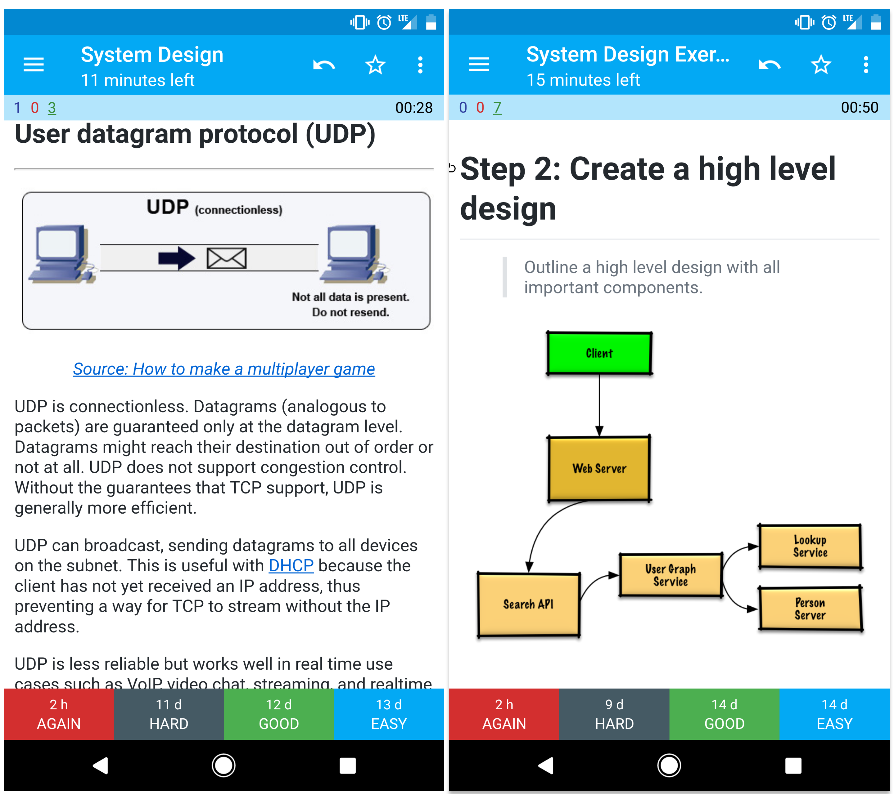

_Original document: https://github.com/donnemartin/system-design-primer_

_Trạng thái phiên dịch: **đang dịch**_

# Động lực

> Học cách để thiết kế các hệ thống quy mô lớn

Chuẩn bị cho các buổi phỏng vấn thiết kế hệ thống

>

## Học cách để thiết kế các hệ thống quy mô lớn

Việc học cách thiết kế các hệ thống có khả năng mở rộng sẽ giúp bạn trở thành một kĩ sư giỏi hơn.

Thiết kế hệ thống là một chủ đề rộng lớn. Có **rất nhiều các tài nguyên nằm rải rác trên các web** về các nguyên tắc thiết kế hệ thống.

Repo này là một **bộ sưu tầm các tài nguyên** giúp bạn tìm hiểu cách để xây dựng các hệ thống trên quy mô lớn.

## Học hỏi từ các cộng động mã nguồn mở

Đây là một dự án mã nguồn mở được cập nhật liên tục.

Mọi sự đóng góp đều được hoan nghênh!

## Chuẩn bị cho buổi phỏng vấn thiết kế hệ thống

Ngoài các buổi phỏng vấn code, thiết kế hệ thống đã trở thành một **phần thiết yếu** trong **quy trình phỏng vấn kỹ thuật** tại nhiều công ty công nghệ.

Để chuẩn bị cho buổi phỏng vấn thiết kế hệ thống, hãy t**hực hành các câu hỏi phỏng vấn thiết kế hệ thống phổ biến** và **so sánh** kết quả của bạn với các **lời giải mẫu** thông qua các cuộc thảo luận, code, và các sơ đồ.

Các chủ đề bổ sung để chuẩn bị phỏng vấn:

- [Hướng dẫn học](https://github.com/donnemartin/system-design-primer#study-guide)
- [Cách tiếp cận một câu hỏi phỏng vấn thiết kế hệ thống](https://github.com/donnemartin/system-design-primer#how-to-approach-a-system-design-interview-question)
- [Các câu hỏi phỏng vấn về thiết kế hệ thống kèm câu trả lời](https://github.com/donnemartin/system-design-primer#system-design-interview-questions-with-solutions)
- [Các câu hỏi phỏng vấn về thiết kế hệ thống hướng đối tượng kèm câu trả lời](https://github.com/donnemartin/system-design-primer#object-oriented-design-interview-questions-with-solutions)
- [Bổ sung các câu hỏi phỏng vấn về thiết kế hệ thống](https://github.com/donnemartin/system-design-primer#additional-system-design-interview-questions)

# Anki flashcards

Các bộ bài [Anki flashcard](https://apps.ankiweb.net/) được cung cấp sử dụng phương pháp spaced-repitition để giúp bạn nhớ các khái niệm chính trong thiết kế hệ thống.

- [Bộ thiết kế hệ thống](https://github.com/donnemartin/system-design-primer/tree/master/resources/flash_cards/System%20Design.apkg)
- [Bộ các bài tập thiết kế hệ thống](https://github.com/donnemartin/system-design-primer/tree/master/resources/flash_cards/System%20Design%20Exercises.apkg)
- [Bộ các bài tập thiết kế hệ thống hướng đối tượng](https://github.com/donnemartin/system-design-primer/tree/master/resources/flash_cards/OO%20Design.apkg)

Rất tiện lợi để sử dụng dù bạn đang làm gì đi nữa.

## Tài nguyên code: Các thử thách lập trình đầy tính tương tác

Bạn đang tìm kiếm các nguồn tài nguyên để giúp bạn chuẩn bị cho [Buổi phỏng vấn Code?](https://github.com/donnemartin/interactive-coding-challenges)

Kiểm tra repo **[Interactive Coding Challenges](https://github.com/donnemartin/interactive-coding-challenges),** nó chứa một bộ bài Anki bổ sung:

• [Coding deck](https://github.com/donnemartin/interactive-coding-challenges/tree/master/anki_cards/Coding.apkg)

# Đóng góp

> Học hỏi từ cộng đồng.

Vui lòng gửi các pull request để giúp:

- Sửa các lỗi
- Cải thiện các phần
- Thêm các phần mới
- [Phiên dịch](https://github.com/donnemartin/system-design-primer/issues/28)

Các tài liệu được yêu cầu bổ sung nằm trong mục [đang phát triển](https://github.com/donnemartin/system-design-primer#under-development).

Vui lòng tham khảo [Các Nguyên Tắc Đóng Góp](https://github.com/donnemartin/system-design-primer/blob/master/CONTRIBUTING.md).

# Mục lục các chủ đề về thiết kế hệ thống

> Các bài tóm tắt các chủ đề khác nhau về thiết kế hệ thống, bao gồm cả ưu nhược điểm. **Mọi thứ đều là sự đánh đổi.**

Mỗi phần đều chứa các đường dẫn tới các tài liệu chuyên sâu.

>

… (dài quá)

# Hướng dẫn học

> Các chủ đề được đề xuất để tham khảo dựa trên dòng thời gian phỏng vấn của bạn (ngắn, trung bình, dài)

**Q: Liệu tôi có cần biết tất cả những tài liệu đó để phỏng vấn không?**

**A: Không, bạn không cần phải biết tất cả mọi thứ ở đây để chuẩn bị cho buổi phỏng vấn.**

Các câu hỏi bạn được hỏi trong một buổi phỏng vấn có thể khác nhau tùy thuộc vào các biến số như:

- Bạn có bao nhiêu kinh nghiệm
- Nền tảng kĩ thuật của bạn là gì
- Bạn đang phỏng vấn cho vị trí nào
- Bạn đang phỏng vấn với những công ty nào
- Sự may mắn

Các ứng cử viên nhiều kinh nghiệm hơn thường được kì vọng phải có kiến thức chuyên sâu về thiết kế hệ thống. Các kiến trúc sư hoặc trưởng nhóm có thể được kì vọng phải biết nhiều hơn các thành viên cá nhân. Các công ty công nghệ hàng đầu thường có ít nhất một vòng phỏng vấn thiết kế.

Hãy bắt đầu với bức tranh tổng thể ngay từ đầu và đi sâu hơn vào một vài lĩnh vực. Nó giúp ta biết mỗi thứ một chút về các chủ đề chính trong thiết kế hệ thống. Tùy thuộc vào mốc thời gian, kinh nghiệm, chức danh công việc của bạn và công ty mà bạn sắp phỏng vấn, vui lòng tham khảo các hướng dẫn sau.

- **Dòng thời gian ngắn** - Hãy tiếp cận các chủ đề về thiết kế hệ thống một cách **bao quát**. Thử luyện tập bằng cách thử giải quyết một số câu hỏi phỏng vấn.
- **Dòng thời gian trung bình** - Vẫn tiếp cận các chủ đề về thiết kế hệ thống một cách **bao quát** nhưng đi **chuyên sâu** hơn vào một vài lĩnh vực. Luyện tập bằng cách giải quyết nhiều câu hỏi phỏng vấn hơn.
- **Dòng thời gian dài** - Có cái nhìn **bao quát** và **sâu sắc** về các chủ đề thiết kế hệ thống. Và luyện tập bằng cách giải quyết hầu hết các câu hỏi phỏng vấn.

|                                                                                                     | Ngắn     | Trung bình | Dài     |
| --------------------------------------------------------------------------------------------------- | -------- | ---------- | ------- |
| Đọc các Chủ đề về thiết kế hệ thống để có hiểu rộng hơn về cơ chế hoạt động của các hệ thống        | 👍       | 👍         | 👍      |
| Đọc một vài bài viết trong Các bài blog kĩ thuật của doanh nghiệp của công ty mà bạn đang phỏng vấn | 👍       | 👍         | 👍      |
| Đọc một số ví dụ về Các kiến trúc ngoài đời thực                                                    | 👍       | 👍         | 👍      |
| Xem Cách tiếp cận một câu hỏi phỏng vấn về thiết kế hệ thống                                        | 👍       | 👍         | 👍      |
| Làm Các câu hỏi phỏng vấn thiết kế hệ thống và lời giải                                             | Một chút | Nhiều      | Hầu hết |
| Làm Các câu hỏi phỏng vấn thiết kế hướng đối tượng và lời giải                                      | Một chút | Nhiều      | Hầu hết |
| Xem Bổ sung một số câu hỏi phỏng vấn thiết kế hệ thống                                              | Một chút | Nhiều      | Hầu hết |

# Cách tiếp cận một câu hỏi phỏng vấn thiết kế hệ thống

> Tìm cách để giải quyết một câu hỏi phỏng vấn thiết kế hệ thống

Phỏng vấn thiết kế hệ thống là một cuộc hội thoại mở (gồm các câu hỏi không thể trả lời Có hoặc Không mà phải thể hiện ý kiến cá nhân). Bạn được kì vọng phải dẫn dắt cuộc trò chuyện đó.

Bạn có thể sử dụng các bước dưới đây để dẫn một cuộc thảo luận. Để củng cố quy trình này, chúng tôi khuyên bạn nên sử dụng các bước dưới đây để làm phần [Các câu hỏi phỏng vấn thiết kế hệ thống và các lời giải](https://github.com/donnemartin/system-design-primer#system-design-interview-questions-with-solutions).

## Bước 1: Phác thảo các trường hợp sử dụng, các ràng buộc và các giả định

Hãy thu thập các yêu cầu và xác định phạm vi của vấn đề. Đặt ra các câu hỏi để làm rõ các trường hợp sử dụng và các ràng buộc đi kèm. Cuối cùng là thảo luận về các giả định của bạn.

- Đối tượng nào sẽ sử dụng dịch vụ?
- Họ sẽ sử dụng nó như thế nào?
- Có bao nhiêu người dùng?
- Hệ thống phải làm gì?
- Các đầu vào và đầu ra của hệ thống là gì?
- Chúng ta dự kiến xử lý bao nhiêu dữ liệu?
- Chúng ta dự kiến bao nhiêu yêu cầu mỗi giây?
- Tỷ lệ đọc và ghi dự kiến là bao nhiêu?

## Bước 2: Tạo một thiết kế cấp cao

Phác thảo một thiết kế cấp cao với tất cả các thành phần quan trọng.

- Phác thảo các thành phần và các kết nối chính
- Biện minh cho các ý tưởng của bạn

## Bước 3: Thiết kế các thành phần cốt lõi

Chúng ta hãy xem xét kỹ hơn các chi tiết của từng thành phần chính. Ví dụ, nếu bạn được yêu cầu thiết kế [một dịch vụ rút gọn url](https://github.com/donnemartin/system-design-primer/blob/master/solutions/system_design/pastebin/README.md) , bạn có thể thảo luận về các vấn đề sau:

- Việc tạo ra và lưu trữ một mã băm của url đầy đủ
  - [MD5](https://github.com/donnemartin/system-design-primer/blob/master/solutions/system_design/pastebin/README.md) và [Base62](https://github.com/donnemartin/system-design-primer/blob/master/solutions/system_design/pastebin/README.md)
  - Các xung đột băm
  - SQL hay NoSQL
  - Lược đồ cơ sở dữ liệu
- Chuyển đổi một url đã được băm thành url đầy đủ
  - Tra cứu cơ sở dữ liệu
- API và thiết kế hướng đối tượng

## Bước 4: Mở rộng thiết kế

Xác định và giải quyết các nút thắt trong phạm vi các ràng buộc nhất định. Ví dụ, bạn có cần những thứ dưới đây để giải quyết vấn đề về khả năng mở rộng không?

- Cân bằng tải (Load balancer)
- Mở rộng theo chiều ngang (Horizontal scaling)
- Caching
- Phân mảnh cơ sở dữ liệu (Database sharding)

Hãy thảo luận về các giải pháp tiềm năng và sự đánh đổi. Mọi thứ đều có sự đánh đổi. Giải quyết các nút thắt đó bằng cách sử dụng [các nguyên tắc thiết kế hệ thống có khả năng mở rộng](https://github.com/donnemartin/system-design-primer#index-of-system-design-topics)

## Tính toán nhẩm

Đôi khi, bạn có thể sẽ được yêu cầu phải tự mình thực hiện một số ước tính. Bạn có thể tham khảo các nguồn tài nguyên sau của [Appendix](https://github.com/donnemartin/system-design-primer#appendix):

- [Sử dụng các phép tính toán nhẩm](http://highscalability.com/blog/2011/1/26/google-pro-tip-use-back-of-the-envelope-calculations-to-choo.html)
- [Sức mạnh của hai bảng](https://github.com/donnemartin/system-design-primer#powers-of-two-table)
- [Giá trị độ trễ mà mọi lập trình viên nên biết](https://github.com/donnemartin/system-design-primer#latency-numbers-every-programmer-should-know)

## (Các) nguồn đọc thêm

Tham khảo các liên kết sau để biết những ý tưởng hay hơn những câu hỏi phỏng vấn mong đợi:

- [Cách để ghi điểm trong một buổi phỏng vấn thiết kế hệ thống](https://www.palantir.com/2011/10/how-to-rock-a-systems-design-interview/)
- [Phỏng vấn thiết kế hệ thống](http://www.hiredintech.com/system-design)
- [Giới thiệu về Kiến trúc và các buổi Phỏng vấn Thiết Kế Hệ Thống](https://www.youtube.com/watch?v=ZgdS0EUmn70)
- [Mẫu thiết kế hệ thống](https://leetcode.com/discuss/career/229177/My-System-Design-Template)

# Các câu hỏi phỏng vấn thiết kế hệ thống kèm theo lời giải

> Các câu hỏi thiết kế hệ thống phổ biến đi kèm các cuộc thảo luận mẫu, code và các sơ đồ

Các câu trả lời nằm trong thư mục `solutions/`

>

## Thiết kế Pastebin.com (hoặc Bit.ly)

[Xem bài tập và lời giải](https://github.com/donnemartin/system-design-primer/blob/master/solutions/system_design/pastebin/README.md)

## Thiết kế dòng thời gian Twitter và tìm kiếm (hoặc bảng tin Facebook và tìm kiếm)

[Xem bài tập và lời giải](https://github.com/donnemartin/system-design-primer/blob/master/solutions/system_design/twitter/README.md)

……

# Các chủ đề thiết kế hệ thống: Bắt đầu tại đây

Bạn mới làm quen với thiết kế hệ thống?

Trước tiên, bạn sẽ cần có kiến thức cơ bản về các nguyên tắc chung trong thiết kế hệ thống , tìm hiểu xem chúng là gì, cách chúng được ứng dụng cũng như ưu và nhược điểm của chúng.

## Bước 1: Tham khảo các video bài giảng về khả năng mở rộng

[Bài giảng về khả năng mở rộng ở Harvard](https://www.youtube.com/watch?v=-W9F__D3oY4)

- Các chủ đề được đề cập:
  - Mở rộng theo chiều sâu
  - Mở rộng theo chiều dọc
  - Caching
  - Cân bằng tải
  - Nhân rộng cơ sở dữ liệu (Database replication)
  - Phân vùng cơ sở dữ liệu (Database partitioning)\*\*\*\*

## Bước 2: Tham khảo các bài viết về khả năng mở rộng

[Khả năng mở rộng](http://www.lecloud.net/tagged/scalability/chrono)

- Các chủ đề được đề cập:
  - [Các bản sao](http://www.lecloud.net/post/7295452622/scalability-for-dummies-part-1-clones) (Clones)
  - [Cơ sở dữ liệu](http://www.lecloud.net/post/7994751381/scalability-for-dummies-part-2-database)
  - [Caches](http://www.lecloud.net/post/9246290032/scalability-for-dummies-part-3-cache)
  - [Chủ nghĩa không đồng bộ](http://www.lecloud.net/post/9699762917/scalability-for-dummies-part-4-asynchronism) (Asynchronism)

## Các bước tiếp theo

Tiếp đến, chúng ta sẽ xem xét những sự đánh đổi ở cấp độ cao:

- **Hiệu suất** với **khả năng mở rộng**
- **Độ trễ** với **thông lượng**
- **Tính khả dụng** với **tính nhất quán**

Hãy nhớ rằng **mọi thứ là một sự đánh đổi**.

Sau đó, chúng ta sẽ đi sâu hơn vào các chủ đề cụ thể như DNS, CDNs và bộ cân bằng tải

# Hiệu suất với khả năng mở rộng

Một dịch vụ được coi là có thể mở rộng nếu hiệu suất của nó được cải thiện khi có nhiều tài nguyên được thêm vào. Nói chung, việc tăng hiệu suất có nghĩa là phục vụ nhiều đơn vị công việc hơn, nhưng nó cũng có thể là để xử lý các đơn vị công việc lớn hơn, chẳng hạn như khi các bộ dữ liệu phát triển.

Một cách nhìn khác về hiệu năng và khả năng mở rộng:

- Nếu bạn gặp vấn đề về hiệu suất, hệ thống của bạn sẽ chậm đối với một người dùng
- Nếu bạn gặp vấn đề về khả năng mở rộng, hệ thống của bạn sẽ nhanh đối với một người dùng nhưng lại chậm khi phải load nặng (ví dụ như nhiều người dùng)

## (Các) nguồn đọc thêm

- [A word on scalability](http://www.allthingsdistributed.com/2006/03/a_word_on_scalability.html)
- [Scalability, availability, stability, patterns](http://www.slideshare.net/jboner/scalability-availability-stability-patterns/)

# Độ trễ và thông lượng

**Độ trễ** là khoảng thời gian để thực thi một số hành động hoặc tạo ra một số kết quả.

**Thông lượng** là số lượng các hành động hoặc kết quả được thực thi trên một đơn vị thời gian.

Nói chung, bạn nên nhắm đến **số thông lượng tối đa** với **độ trễ có thể chấp nhận được**

## (Các) nguồn đọc thêm

• [HIểu rõ về độ trễ và thông lượng](https://community.cadence.com/cadence_blogs_8/b/sd/archive/2010/09/13/understanding-latency-vs-throughput)

# Tính khả dụng với tính nhất quán

## Định lý CAP

Đối với một hệ thống máy tính phân tán, bạn chỉ có thể đảm bảo hai trong số ba tùy chọn sau:

- **Tính nhất quán** - Mỗi lần đọc sẽ đọc lần ghi gần hoặc lỗi đây nhất.
- **Tính khả dụng** - Mỗi yêu cần đều nhận được một phản hồi mà không đảm bảo rằng nó chứa phiên bản thông tin mới nhất
- **Partition Tolerance** - Hệ thống tiếp tục vận hành bất chấp việc phân vùng tùy ý do các lỗi mạng

Bởi vì m*ạng không đáng tin cậy nên bạn sẽ cần phải đảm bảo Partition Tolerance. Do đó, bạn sẽ phải cân nhắc một sự đánh đổi phần mềm giữa tính nhất quán và tính khả dụng.*

CP - **tính nhất quán (Consistency)** và \***\*Partition Tolerance\*\***

Việc chờ đợi phản hồi từ các nút được phân vùng có thể dẫn tới lỗi timeout. CP là một lựa chọn tốt nếu nghiệp vụ của bạn yêu cầu các thao tác đọc và ghi nguyên tử (atomic).

AP - **tính khả dụng (Availability)** và \***\*Partition Tolerance\*\***

Vì các phản hồi trả về phiên bản dữ liệu dễ đọc nhất từ bất kỳ nút nào, nên không có gì đảm bảo rằng chúng luôn được cập nhật. Khi phân vùng xảy ra, có thể mất nhiều thời gian hơn một chút để dữ liệu từ thao tác ghi được phản ánh.

## (Các) nguồn đọc thêm

- [CAP theorem revisited](http://robertgreiner.com/2014/08/cap-theorem-revisited/)
- [A plain english introduction to CAP theorem](http://ksat.me/a-plain-english-introduction-to-cap-theorem)
- [CAP FAQ](https://github.com/henryr/cap-faq)
- [The CAP theorem](https://www.youtube.com/watch?v=k-Yaq8AHlFA)

# Các mẫu nhất quán

Khi có nhiều bản sao của cùng một dữ liệu, chúng ta phải đối mặt với nhiều lựa chọn trong cách đồng bộ hóa để đảm bảo rằng khách hàng có một cái nhìn nhất quán về dữ liệu đó. Chúng ta hãy nhớ lại định nghĩa của tính nhất quán thông qua [định lý CAP](https://github.com/donnemartin/system-design-primer#cap-theorem). - Mọi thao tác đọc đều đọc dữ liệu hoặc lỗi thao tác ghi gần đây nhất.

## Tính nhất quán yếu

Sau một thao tác ghi, một thao tác đọc có thể đọc hoặc không đọc được dữ liệu bạn đã ghi. Mặc dù áp dụng cách tiếp cận tốt nhất có thể, những kết quả này có thể xảy ra.

Cách tiếp cận này có thể được nhìn thấy trong các hệ thống như memcached. Tính nhất quán yếu hoạt động tốt trong các trường hợp sử dụng thời gian thực như VoIP, gọi điện video và các trò chơi nhiều người chơi trong thời gian thực. Ví dụ, nếu bạn đang gọi điện và bị ngắt kết nối trong vài giây, thì khi kết nối được khôi phục bạn sẽ không thể biết những gì đã được nói trong khoảng thời gian bị mất kết nối đó.

## Tính nhất quán có độ trễ

Sau một thao tác ghi, thao tác đọc có thể đọc dữ liệu đó sau một khoảng thời gian nhất định (thường mất mili giây). Dữ liệu thường được sao chép bất đồng bộ. Cách tiếp cận này có thể được nhìn thấy trong các hệ thống như DNS và E-mail. Tính nhất quán có độ trễ đóng hoạt động tốt trong các hệ thống có tính khả dụng cao.

## Tính nhất quán mạnh mẽ

Sau một thao tác ghi, dữ liệu có thể được đọc mà không bị lỗi. Dữ liệu thường được sao chép đồng bộ.

Cách tiếp cận này có thể được nhìn thấy trong các hệ thống như hệ thống tệp, RDBMS. Tính nhất quán mạnh mẽ hoạt động tốt trong các hệ thống yêu cầu giao dịch.

## (Các) nguồn đọc thêm

- [Các giao dịch giữa nhiều trung tâm dữ liệu](http://snarfed.org/transactions_across_datacenters_io.html)

# Các mẫu khả dụng

Có hai loại mẫu hỗ trợ tính khả dụng cao: **fail-ove**r và **replication**

## Fail-over

**Actie-passive**

Với active-passive fail-over, các [heartbeat](https://www.notion.so/Final-14bfe5d5e6fd49f79b964b3b74ec0bc5) sẽ được gửi qua lại giữa hai loại máy chủ là máy chủ chủ động và máy chủ bị động ở chế độ chờ. Nếu heartbeat bị gián đoạn, máy chủ bị động sẽ lấy địa chỉ IP của máy chủ chủ động và tiếp tục dịch vụ.

Việc máy chủ bị động đang chạy ở trạng thái chờ ‘hot’ hay nó cần được khởi động từ trạng thái chờ ‘lạnh’ sẽ xác định được thời lượng downtime. Chỉ các máy chủ chủ động mới được xử lý lưu lượng truy cập

**Actie-active**

Trong active-active fail-over, cả hai máy chủ đều quản lý lưu lượng truy cập và cân bằng tải giữa chúng.

Nếu hai máy chủ ở chế độ công khai, DNS sẽ cần phải biết IP công cộng của cả hai máy chủ. Nếu chúng là máy chủ hướng nội bộ, logic ứng dụng phải biết thông tin về cả hai máy chủ.

Active-active fail-over khá giống với master-master fail-over

## (Các) nhược điểm: fail-over

- Fail-over yêu cầu nhiều phần cứng hơn và tăng thêm độ phức tạp
- Có khả năng bị mất dữ liệu nếu máy chủ chủ động gặp lỗi và không kịp sao chép dữ liệu mới vừa ghi sang máy chủ bị động.

## Replication

\***\*Master-slave và master-master\*\***

Chỉ đề này sẽ được bàn luận tại mục [Database](https://www.notion.so/Final-14bfe5d5e6fd49f79b964b3b74ec0bc5):

- [Master-slave replication](https://github.com/donnemartin/system-design-primer#master-slave-replication)
- [Master-master replication](https://github.com/donnemartin/system-design-primer#master-master-replication)

## Con số của tính khả dụng

Tính khả dụng thường có thể được biểu thị bằng phần trăm khả năng cung cấp dịch vụ theo thời gian hoạt động (hoặc thời gian ngưng hoạt động). Tính khả dụng thường được đo dựa theo số lượng các số 9 ([Five Nines](https://www.notion.so/Final-14bfe5d5e6fd49f79b964b3b74ec0bc5)). Một dịch vụ với mức độ khả dụng 99,99% thường có bốn số 9.

\***\*mức độ khả dụng 99.9% - ba số 9\*\***

| Thời lượng | Thời gian ngừng hoạt động chấp nhận được |
| ---------- | ---------------------------------------- |
| Hàng năm   | 8 tiếng 45 phút 57 giây                  |
| Hàng tháng | 43 phút 49.7 giây                        |
| Hàng tuần  | 10 phút 4.8 giây                         |
| Hàng ngày  | 1 phút 26.4 giây                         |

\***\*mức độ khả dụng 99.9% - bốn số 9\*\***

| Thời lượng | Thời gian ngừng hoạt động chấp nhận được |
| ---------- | ---------------------------------------- |
| Hàng năm   | 52 phút 35.7 giây                        |
| Hàng tháng | 4 phút 23 giây                           |
| Hàng tuần  | 1 phút 5 giây                            |
| Hàng ngày  | 8.6 giây                                 |

**Tính khả dụng song song với tuần tự**

Nếu một dịch vụ chứa nhiều thành phần dễ bị lỗi thì tính khả dụng tổng thể của dịch vụ đó sẽ phụ thuộc vào các thành phần đó là song song hay tuần tự.

Tuần tự

Tính khả dụng tổng thể sẽ bị giảm nếu hai thành phần có tính khả dụng dưới 100% in sequence?:

`Availability (Total) = Availability (Foo) * Availability (Bar)`

Nếu cả `Foo` và `Bar` đều có 99.9% tính khả dụng thì tổng giá trị khả dụng của chúng in sequnce sẽ là 99.8%

Song song

Tính khả dụng tổng thể sẽ tăng lên nếu hai thành phần có tính khả dụng dưới 100% song song:

`Availability (Total) = 1 - (1 - Availability (Foo)) * (1 - Availability (Bar))`

Nếu cả `Foo` và `Bar` đều có 99.9% tính khả dụng thì tổng giá trị khả dụng của chúng sẽ là 99.9999%.

# Hệ thống tên miền

Một hệ thống tên miền (DNS) sẽ dịch một tên miền như www.example.com sang một địa chỉ IP.

DNS mang tính phân cấp, với một vài máy chủ có tính thẩm quyền ở cấp cao nhất. Bộ định tuyến của bạn hoặc ISP cung cấp thông tin về (các) máy chủ DNS cần liên hệ khi thực hiện tra cứu. Các máy chủ DNS cấp thấp hơn sẽ cache các ánh xạ, khiến chúng có thể sẽ trở nên cũ kĩ do sự lan truyền chậm trễ DNS. Các kết quả DNS cũng có thể được cache bởi trình duyệt của bạn hoặc hệ điều hành trong một khoảng thời gian nhất định, được xác định bởi [thời gian tồn tại](https://en.wikipedia.org/wiki/Time_to_live) (TTL).

- **Bản ghi NS (tên máy chủ)** - Chỉ định các máy chủ DNS cho tiền miền/ tiền miền phụ của bạn.
- **Bản ghi MX (trao đổi thư)** - Chỉ định các máy chủ thư để nhận các tin nhắn
- **Bản ghi A (địa chỉ)** - Trỏ một tên tới một địa chỉ IP
- **CNAME (bình thường hóa)** - Trở một tên tới một tên khác hoặc `CNAME` (example.com to [www.example.com](http://www.example.com/)) hoặc tới một bản ghi `A` .

Các dịch vụ như CloudFlare hoặc Route 53 cung cấp các dịch vụ Managed DNS. Một số dịch vụ DNS có thể định tuyến lưu lượng thông quá nhiều phương thức khác nhau:

- [Weighted round robin](https://www.jscape.com/blog/load-balancing-algorithms)
  - Ngăn lưu lượng truy cập đến các máy chủ đang được bảo trì
  - Cân bằng giữa các kích thước cụm khác nhau
  - Kiểm tra A/B
- [Latency-based](https://docs.aws.amazon.com/Route53/latest/DeveloperGuide/routing-policy.html#routing-policy-latency)
- [Geolocation-based](https://docs.aws.amazon.com/Route53/latest/DeveloperGuide/routing-policy.html#routing-policy-geo)

## (Các) nhược điểm: DNS

- Việc truy cập một máy chủ DNS gây ra một độ trễ nhẹ dù đã được giảm thiểu bằng phương thức caching đã được mô tả ở trên.
- Việc quản lý máy chủ DNS có thể phức tạp và thường được quản lý bởi các chính phủ, IPS và các công ty lớn.
- Các dịch vụ DNS gần đây đã bị tấn công DDoS, ngăn người dùng truy cập các trang web như Twitter mà không biết (các) địa chỉ IP của Twitter.

## (Các) nguồn đọc thêm

- [Kiến trúc DNS](<https://technet.microsoft.com/en-us/library/dd197427(v=ws.10).aspx>)
- [Wikipedia](https://en.wikipedia.org/wiki/Domain_Name_System)
- [Các bài viết về DNS](https://support.dnsimple.com/categories/dns/)

# Mạng lưới phân phối nội dung

Một mạng lưới phân phối nội dung (CDN) là một mạng lưới phân phối toàn cầu gồm các máy chủ proxy, nó cung cấp nội dung cho nguời dùng từ các máy chủ gần họ nhất về mặt địa lý. Thông thường, các tệp tĩnh như HTML/ CSS/ JS, ảnh, và video được phân phối từ CDN, nhưng một vài CDNs ,chẳng hạn như Amazon’s CloudFont thì hỗ trợ cả các nội dung động.

Cung cấp nội dung từ các CDN có thể tăng hiệu năng một cách đáng kể theo hai hướng sau:

- Người dùng nhận nội dung từ trung tâm dữ liệu gần họ
- Các máy chủ của bạn không cần phải phục vụ các yêu cầu mà CDN hoàn tất

## Push CDNs

Push CDNs nhận các nội dung mới mỗi khi có sự thay đổi xảy ra tại máy chủ của bạn. Bạn nhận hoàn toàn trách nhiệm cho việc cung cấp nội dung, cập nhập trực tiếp vào CDN và ghi lại các URL để trỏ tới CDN. Bạn có thể cấu hình khi nào nội dung hết hạn và khi nào nó được cập nhật. Nội dung được tải lên chỉ khi nó mới hoặc khi nó bị thay đổi, giảm thiểu lưu lượng truy cập nhưng tối đã hóa dung lượng lưu trữ.

Các trang web có lượng truy cập nhỏ hoặc có nội dung không được cập nhật thường xuyên thì push CDNs là một lựa chọn tốt. Nội dung chỉ được đặt một lần duy nhất trên CDN, không phải một cách thường xuyên.

## Pull CDNs

Pull CDNs tải nạp nội dung mới từ máy chủ của bạn khi người dùng đầu tiên yêu cầu nội dung. Bạn giữ nguyên nội dung nằm trên máy chủ của bạn và ghi lại các URL để trỏ tới CDN. Điều này khiến cho yêu cầu đó bị trì hoãn cho tới khi nội dung được lưu vào bộ nhớ cache trên CDN.

[Time-to-live (TTL)](https://en.wikipedia.org/wiki/Time_to_live) xác định thời gian mà nội dung được lưu trữ trong bộ nhớ cache. Pull CDNs giảm thiểu không gian lưu trữ trên CDN, nhưng có thể tạo ra lưu lượng dư thừa nếu các tệp hết hạn và được tải về trước khi chúng thực sự thay đổi.

Các trang web có lượng truy cập cao sẽ hoạt động tốt với các pull CDNs, vì lượng truy cập được phân bổ đồng đều hơn và trên CDN chỉ còn lại các nội dung được yêu cầu gần đây

# Danh sách các thuật ngữ chuyên ngành

1. Node: Server thuộc Cluster
2. Fail-over: khi có 1 hoặc nhiều node trong Cluster xảy ra vấn đề, các tài nguyên (resources) sẽ tự động được chuyển tới các node sẵn sàng phục vụ
3. Heartbeat: là tín hiệu xuất phát từ các node với mục đích xác nhận rằng chúng còn sống và vẫn đang hoạt động
4. Five nines: là cụm từ miêu tả tính khả dụng của một dịch vụ tại mức 99.999% (5 số 9) trong tổng số thời gian nó được yêu cầu.
